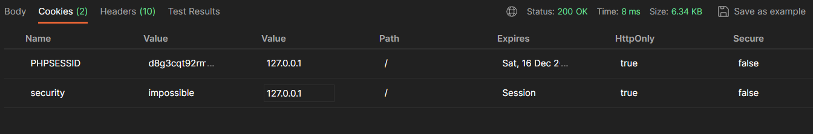

sessions

cookie

登录的包：

```http
POST /login.php HTTP/1.1
Host: dvwa:8088
User-Agent: Mozilla/5.0 (Windows NT 10.0; WOW64; rv:56.0) Gecko/20100101 Firefox/56.0
Accept: text/html,application/xhtml+xml,application/xml;q=0.9,image/avif,image/webp,*/*;q=0.8
Accept-Language: zh-CN,zh;q=0.8,zh-TW;q=0.7,zh-HK;q=0.5,en-US;q=0.3,en;q=0.2
Accept-Encoding: gzip, deflate, br
Content-Type: application/x-www-form-urlencoded
Content-Length: 88
Origin: http://dvwa:8088
Connection: close
Referer: http://dvwa:8088/login.php
Cookie: cprmf8pdnv7nkpv259fh5o18eh
Upgrade-Insecure-Requests: 1

username=admin&password=password&Login=Login&user_token=78929b66e5affec953339b07d1b4975e
```

user_token是每次登录随机生成的。


如果正常访问某个资源

```http
GET /login.php HTTP/1.1
Host: dvwa:8088
User-Agent: Mozilla/5.0 (Windows NT 10.0; WOW64; rv:56.0) Gecko/20100101 Firefox/56.0
Accept: text/html,application/xhtml+xml,application/xml;q=0.9,image/avif,image/webp,*/*;q=0.8
Accept-Language: zh-CN,zh;q=0.8,zh-TW;q=0.7,zh-HK;q=0.5,en-US;q=0.3,en;q=0.2
Accept-Encoding: gzip, deflate, br
Referer: http://dvwa:8088/login.php
Connection: close
Cookie: cprmf8pdnv7nkpv259fh5o18eh
Upgrade-Insecure-Requests: 1
```

只需要cookie即可。


访问页面，会给你一个user_token","value":"2406509bbd035beb3a2ed6fec50a200e"

然后输入账号，密码，还有Login标识符，post提交给127.0.0.1:8088/login.php

然后就能进入主页。

这时候会返回两个值：



Cookies有两个值。

这两个值会被存储在本地浏览器的cookies中

以后的请求都会带上Cookies这个请求头，内容是这两个值。


